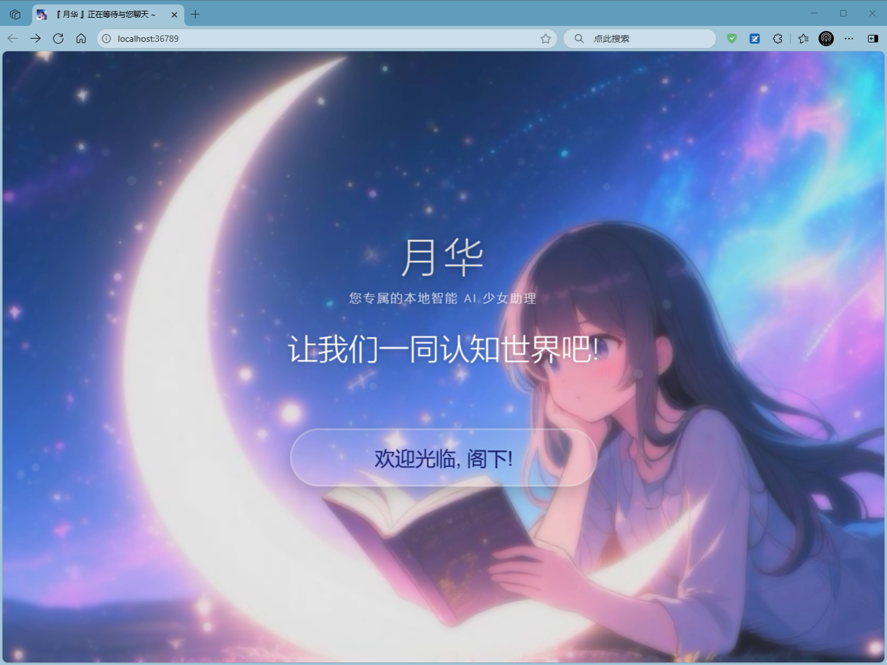

# Lunar Astral Agents (星月智能 - 月之华)

Lunar Astral Agents 是一个基于 Go 语言和现代前端技术构建的智能体项目，旨在为用户提供一个功能强大、交互友好的 AI 助手，用于聊天、学习、工作和生活陪伴。


## 项目预览



[查看更多](document/image.md)

## 项目特点

- **多模态交互**：支持语言输入输出（需使用 Microsoft Edge）、图片与视频的查阅和理解能力
- **创意生成**：具有绘制图片的能力，满足用户的创意需求
- **知识库集成**：基于本地知识库进行回答，提供个性化的知识服务
- **用户友好界面**：提供直观的用户交互界面，便于与智能体进行交互
- **文件管理**：带有简单的文件管理页面，用于查看项目的本地存储
- **绘图工作室**：带有专门的绘图工作室页面，满足更加精细的图片创造需求
- **数据库管理**：带有简单的 SQL 数据库管理页面，用于管理本地数据库内容
- **OpenAI v1 协议兼容**：提供全面的 OpenAI v1 协议端口，支持多种连接方式

## 技术栈

| 技术       | 用途       | 版本要求       |
| ---------- | ---------- | -------------- |
| Go         | 后端开发   | 1.21+          |
| HTML5      | 前端开发   | 现代浏览器支持 |
| CSS3       | 前端开发   | 现代浏览器支持 |
| JavaScript | 前端开发   | 现代浏览器支持 |
| WebSocket  | 实时通信   | -              |
| GGUF       | 模型格式   | -              |
| SQLite     | 本地数据库 | -              |

## 目录结构

```text
Lunar_Astral_Agents/
├── document/          # 项目文档
├── image/             # 项目图片资源
├── local_data/        # 本地数据存储
├── script/            # 脚本文件
├── server/            # 后端服务器代码
│   ├── config/        # 配置文件
│   ├── handlers/      # HTTP请求处理器
│   ├── llama/         # GGUF模型相关代码
│   ├── metadata/      # 元数据处理
│   ├── release/       # 发布相关功能
│   ├── utils/         # 工具函数
│   ├── websocket/     # WebSocket服务
│   ├── create.go      # 服务器创建
│   └── manage.go      # 服务器管理
├── subsystem/         # 子系统组件
├── webpage/           # 前端页面
│   ├── chat-dialogue/ # 聊天对话页面
│   ├── data-keeper/   # 数据管理页面
│   ├── file-vault/    # 文件管理页面
│   └── image-studio/  # 绘图工作室页面
├── go.mod             # Go模块文件
├── go.sum             # Go依赖校验文件
├── main.go            # 主入口文件
└── LICENSE            # 许可证文件
```

## API 端点

| 端点路径            | 方法   | 功能描述       | 文档路径                                                                           |
| ------------------- | ------ | -------------- | ---------------------------------------------------------------------------------- |
| /save               | POST   | 文件保存       | [document/http-api/file_save.md](document/http-api/file_save.md)                   |
| /read/              | GET    | 文件读取       | [document/http-api/file_read.md](document/http-api/file_read.md)                   |
| /file_list/         | POST   | 文件列表       | [document/http-api/file_list.md](document/http-api/file_list.md)                   |
| /download/          | GET    | 文件下载       | [document/http-api/file_download.md](document/http-api/file_download.md)           |
| /delete/            | DELETE | 文件删除       | [document/http-api/file_delete.md](document/http-api/file_delete.md)               |
| /archive            | POST   | 文件归档       | [document/http-api/archive.md](document/http-api/archive.md)                       |
| /v1/models          | GET    | 模型列表       | [document/http-api/model_list.md](document/http-api/model_list.md)                 |
| /v1/chat/completions| POST   | 智能体交互     | [document/http-api/chat_completions.md](document/http-api/chat_completions.md)     |
| /v1/embeddings      | POST   | 文本嵌入       | [document/http-api/embeddings.md](document/http-api/embeddings.md)                 |
| /generate           | POST   | 生成图片       | [document/http-api/generate.md](document/http-api/generate.md)                     |
| /generate/wait      | GET    | 等待生成       | [document/http-api/generate_wait.md](document/http-api/generate_wait.md)           |
| /knowledge/query    | POST   | 知识查询       | [document/http-api/knowledge_query.md](document/http-api/knowledge_query.md)       |
| /knowledge/write    | POST   | 知识写入       | [document/http-api/knowledge_write.md](document/http-api/knowledge_write.md)       |
| /knowledge/flush    | POST   | 知识刷新       | [document/http-api/knowledge_flush.md](document/http-api/knowledge_flush.md)       |
| /knowledge/delete   | POST   | 知识删除       | [document/http-api/knowledge_delete.md](document/http-api/knowledge_delete.md)     |
| /knowledge/list     | GET    | 知识列表       | [document/http-api/knowledge_list.md](document/http-api/knowledge_list.md)         |
| /capture            | POST   | 通用截图       | [document/http-api/screenshot.md](document/http-api/screenshot.md)                 |
| /capture/display/   | GET    | 屏幕截图       | -                                                                                  |
| /capture/region     | POST   | 区域截图       | -                                                                                  |
| /resize             | POST   | 图片缩放       | [document/http-api/resize.md](document/http-api/resize.md)                         |
| /extract/keyframes  | POST   | 视频关键帧提取 | [document/http-api/extract_keyframes.md](document/http-api/extract_keyframes.md)   |
| /extract/firstframe | POST   | 视频首帧提取   | [document/http-api/extract_firstframe.md](document/http-api/extract_firstframe.md) |
| /proxy              | POST   | 代理请求       | [document/http-api/proxy.md](document/http-api/proxy.md)                           |
| /database/          | POST   | 数据库操作     | [document/http-api/database.md](document/http-api/database.md)                     |

## 构建与运行

### 构建 Webview 版本（需要 CGO）

```bash
# 为可执行文件添加图标
rsrc -ico app.ico -o app.syso

# 启用 CGO 并构建支持 webview 的版本
set CGO_ENABLED=1
go build -tags webview -o Lunar-Astral-Agents-webview.exe main.go
```

**注意**：webview 需要 CGO 支持，编译时需要满足以下条件：

- **Windows**：需要安装 MinGW-w64 或 TDM-GCC
- **macOS**：需要安装 Xcode 命令行工具
- **Linux**：需要安装 GTK3 开发库 (`libgtk-3-dev`)

### 构建普通版本

```bash
# 为可执行文件添加图标
rsrc -ico app.ico -o app.syso

# 构建可执行文件
go build -o Lunar-Astral-Agents.exe main.go
```

### 运行项目

```bash
# 直接运行可执行文件
./Lunar-Astral-Agents.exe

# 或使用go run直接运行
go run main.go

# 使用 webview 模式运行（需要 webview 版本）
./Lunar-Astral-Agents-webview.exe --use-webview=true

# 自定义 webview 窗口参数
./Lunar-Astral-Agents-webview.exe --use-webview=true --webview-width=1920 --webview-height=1080 --webview-title="我的知识库"
```

### 命令行参数

| 参数 | 默认值 | 说明 |
|------|--------|------|
| `--use-webview` | false | 是否使用 webview 内嵌浏览器 |
| `--webview-title` | "月之华 - 知识库浏览器" | webview 窗口标题 |
| `--webview-width` | 1280 | webview 窗口宽度 |
| `--webview-height` | 720 | webview 窗口高度 |
| `--webview-resizable` | true | webview 窗口是否可调整大小 |
| `--webview-debug` | false | webview 调试模式 |
| `--basic-port` | 36789 | 系统 Web 服务的监听端口 |
| `--dev-mode` | false | 启用调试模式，显示详细日志且不自动打开 Web 界面 |

## OpenAI v1 协议端口

项目提供了三种类型的 OpenAI v1 协议端口，以满足不同场景的需求：

### 1. 模型直连端口

不支持 `/models` 路径，直接连接到模型，适合简单的模型调用场景。

访问地址：

- <http://localhost:36792/v1>
- <http://localhost:36790/v1>

### 2. 支持/models 的端口

完整支持 OpenAI v1 协议的模型管理功能，适合需要完整协议支持的场景。

访问地址：

- <https://localhost:36789/v1>

### 3. 智能体端口

项目前后端协调运行的智能体端口，内置系统提示词、文本嵌入和上下文管理机能，适合复杂的智能体交互场景。

访问地址：

- <http://localhost:36794/v1>

## 依赖管理

项目使用 Go 模块进行依赖管理，通过 `go.mod` 文件记录和管理所有依赖项。主要依赖库及其用途如下：

- **github.com/disintegration/imaging**：提供图像处理功能，用于图片的编辑和转换
- **github.com/kbinani/screenshot**：实现屏幕截图功能，支持不同显示设备的截图操作
- **github.com/mattn/go-sqlite3**：SQLite 数据库驱动，用于本地数据的存储和管理
- **github.com/u2takey/ffmpeg-go**：FFmpeg 的 Go 语言封装库，用于视频处理相关功能
- **golang.org/x/net**：提供网络工具和扩展功能，支持项目的网络通信需求

这些依赖库共同支持了项目的核心功能，确保了系统的稳定运行和良好性能。

## 许可证

本项目采用 MIT 许可证，详见 [LICENSE](LICENSE) 文件。
