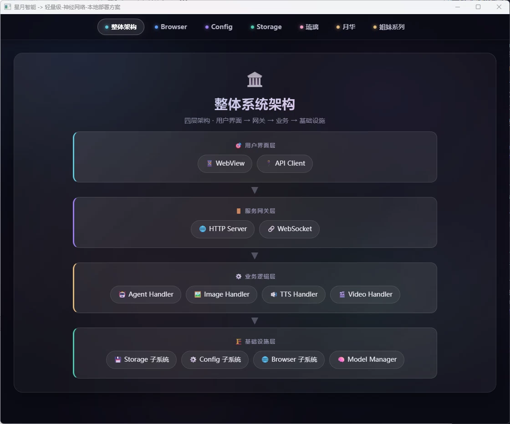

# 星月智能 - 本地部署桌面端智能体

> 🌙 **星月智能**是一套基于 Go + TypeScript 构建的本地部署桌面端智能体系统，包含两位已实现的拟人化智能体——**月华**与**琉璃**，以及规划中的**蔷薇**，为用户提供自然语言交互、图像生成、文件管理等丰富功能。

## 📁 项目结构

```
Lunar_Astral_Agents/
├── luna_astral/          # 星图-月华 - 核心智能体
│   ├── server/          # HTTP服务模块
│   ├── model/           # 模型管理模块
│   ├── adapters/        # JavaScript运行时环境（goja）与适配器函数
│   ├── hierarchy/       # 前端资源（含agentSystem.js）
│   ├── server_side/     # TypeScript服务端逻辑
│   ├── control/         # 流程控制模块（延迟/限流/计划）
│   └── release/         # 进程管理模块（端口释放/进程终止）
├── crystal_astral/       # 星图-琉璃 - 扩展智能体
│   └── assets/          # 前端资源
├── subsystem/            # 通用子系统
│   ├── storage/         # 数据存储子系统（含module/server双架构）
│   ├── config/          # 配置管理子系统
│   ├── browser/         # 浏览器集成子系统
│   ├── screenshot/      # 截图子系统
│   ├── LunarTick/       # 编程语言解释器
│   ├── project_archiving/# 项目归档子系统
│   ├── webp/            # WebP图像处理
│   ├── bridge_adapter/  # 桥接适配器
│   └── proxy/           # 代理子系统
└── local_data/          # 本地数据目录
    ├── models/          # AI模型文件
    ├── package/         # 扩展包
    └── audios/          # 音频资源
```

**子系统文档：**

- [数据存储子系统](docs/subsystem/storage.md)
- [配置管理子系统](docs/subsystem/config.md)
- [浏览器集成子系统](docs/subsystem/browser.md)
- [截图子系统](docs/subsystem/screenshot.md)
- [编程语言解释器](docs/subsystem/LunarTick.md)
- [项目归档子系统](docs/subsystem/project_archiving.md)
- [WebP图像处理](docs/subsystem/webp.md)
- [桥接适配器](docs/subsystem/bridge_adapter.md)
- [代理子系统](docs/subsystem/proxy.md)
- [扩展包](docs/package/index.md)

---

## 🎭 智能体介绍

### 星图·月华 (luna_astral) 

> 俏皮可爱的邻家少女，隶属于星月智能的核心智能体。她拥有温暖耐心的性格，擅长处理复杂任务，是您最可靠的AI伙伴。月华是琉璃的姐姐。详细信息请参阅[星图·月华 文档](docs/luna_astral.md)。

**核心能力**：

- 🧠 自然语言对话（支持多种LLM模型）
- 🎨 AI图像生成（Stable Diffusion）
- 🔊 TTS语音合成（Qwen3-TTS）
- 📁 文件管理与数据库操作
- 🎬 视频关键帧提取

### 星图·琉璃 (crystal_astral) 

> 优雅灵动的扩展智能体，专注于应用管理与系统增强。她是月华的妹妹，为整个系统提供扩展支持能力。详细信息请参阅[星图·琉璃 文档](docs/crystal_astral.md)。

**核心能力**：

- 🖼️ 动态背景管理
- 🚀 应用快捷启动
- 📷 屏幕截图功能
- 📐 图片缩放处理

### 蔷薇 - 规划中

> 星月智能的新姐妹，目前处于规划阶段。她将整合鉴权、代理和多应用适配等综合职能，成为系统的安全守护者和网络桥梁。详细规划请参阅[星图·蔷薇 文档](docs/reserved_agents.md)。

**预计核心能力**：

- 🔐 用户身份认证与授权管理
- 🌐 统一API网关与请求代理
- 🔄 多应用适配与协议转换

---

## 🚀 快速开始

### 环境要求

#### 操作系统支持
- **操作系统**: Windows 10/11 (64位)

#### 开发环境
- **Go版本**: >= 1.24
- **Node.js**: >= 20.x (用于TypeScript编译)

#### 必须安装的运行时依赖
- CUDA 12 或 13 版本
- Microsoft Edge WebView2 Runtime
- FFmpeg
- CUDA Toolkit

### 运行时配置要求

#### TTS语音合成配置
- **Qwen TTS**（选择性启用）：GPU推理，需4GB显存
- **MOSS TTS**（选择性启用）：CPU推理，需2GB内存

#### 图像生成配置
- **图片生成功能**（选择性启用）：GPU推理，需8GB及以上显存

#### LLM模型配置
- **禁用本地LLM推理时**：内存100MB以上
  - ⚠️ 配置说明：必须在配置文件中正确设置云模型的API地址与对应的API密钥
- **启用本地LLM推理时**：
  - 推荐配置：内存32GB以上，显存12GB以上
  - 最低理想配置：内存16GB，显存8GB

### 安装步骤

```powershell
# 1. 克隆项目
git clone https://github.com/LunarAstral/Lunar_Astral_Agents.git
cd Lunar_Astral_Agents

# 2. 构建月华智能体
cd luna_astral
.\build.ps1

# 3. 构建星图·琉璃
cd ../crystal_astral
.\build.ps1

# 4. 返回根目录运行
cd ..
.\build.ps1
```

### 运行方式

```powershell
# 启动星图·月华核心服务
.\luna_astral\luna_astral.exe

# 启动星图·琉璃扩展服务（可选）
.\crystal_astral\crystal_astral.exe
```

---

## 🏗️ 系统架构



---

## 🤝 贡献指南

欢迎贡献代码！请遵循以下规范：

1. 代码风格：Go使用 `go fmt`，TypeScript使用 `prettier`
2. 提交信息：遵循 [Conventional Commits](https://www.conventionalcommits.org/)
3. PR流程：先创建Issue讨论，再提交PR

---

## 📄 许可证

本项目采用 MIT 许可证。详见 [LICENSE](LICENSE) 文件。

---

## 🌙 关于星月智能

星月智能致力于打造本地化、私有化的AI智能体系统，让每个用户都能拥有自己的专属AI伙伴。月华、琉璃与蔷薇（规划中）三位姐妹，将陪伴您探索无限可能。

> _"在星空中寻找答案，在月光下创造美好"_ 🌙✨
