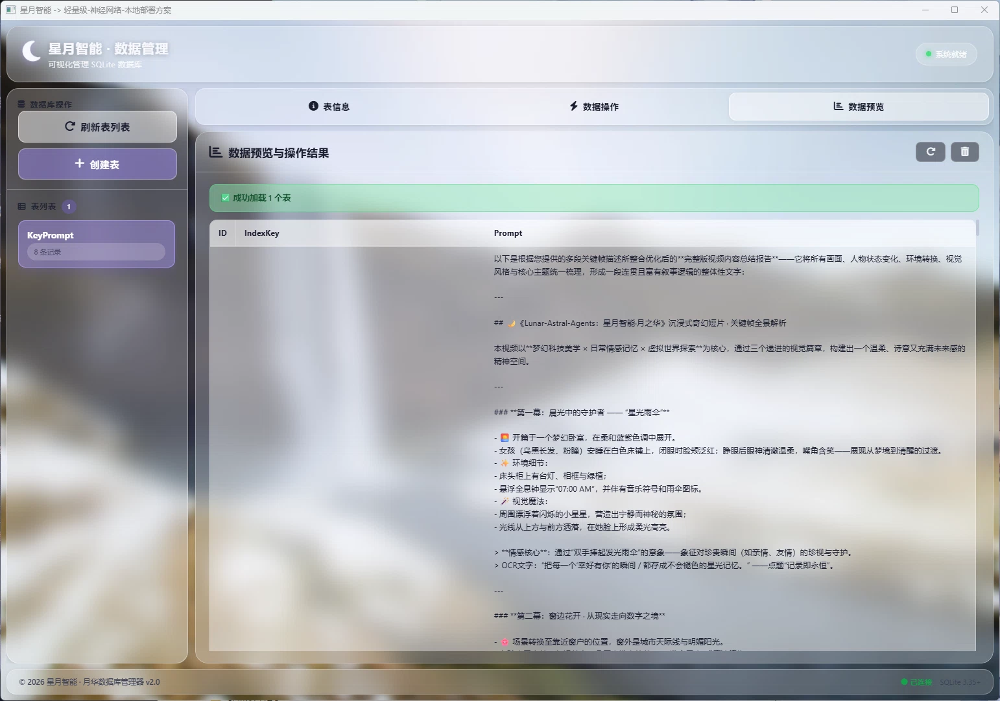
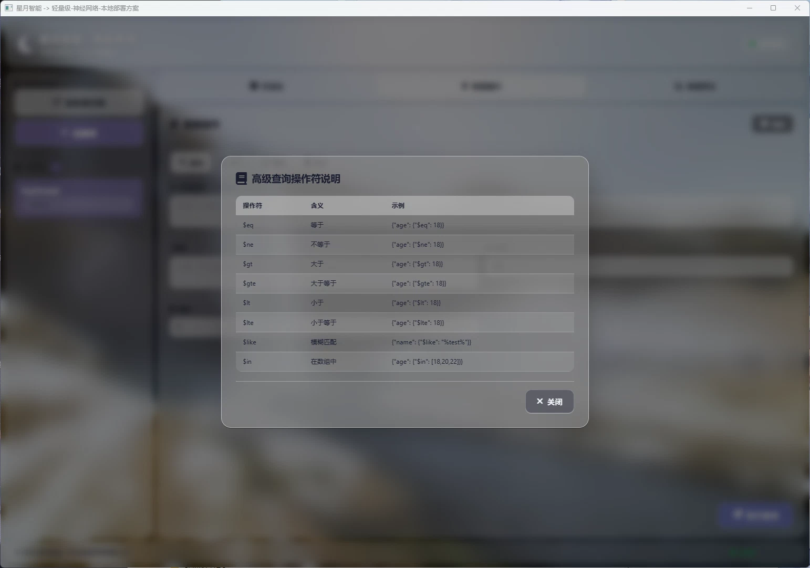
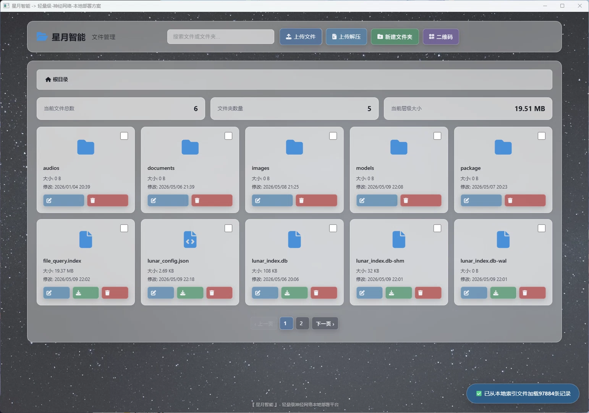
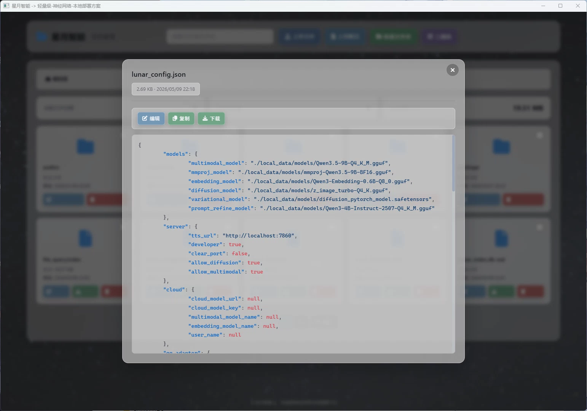
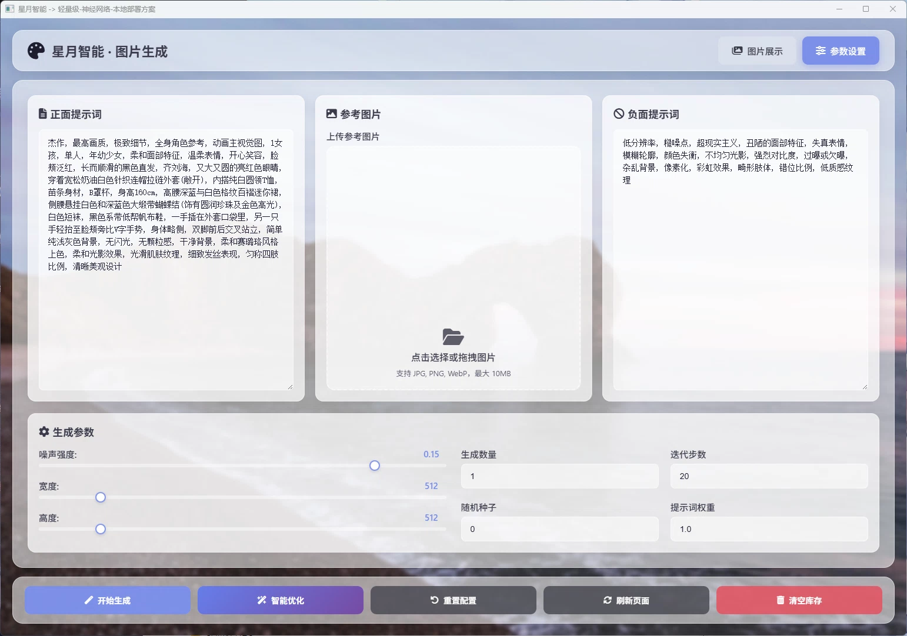
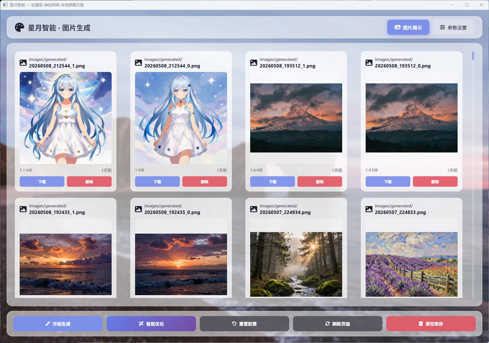

# 扩展系统——星图·琉璃（crystal_astral）

工具集扩展程序，提供文件管理、数据库管理、截图标注、AI 代理转发与应用加载等综合功能。

---

## 人格智能体：琉璃

**琉璃**寓意为「如水晶般澄澈」——她代表着透明、轻盈与纯粹的本真。

琉璃的性格如同水晶一般清透明澈、轻盈灵动。她不做无谓的修饰，而是以最简洁直接的方式完成每一项任务。在技术上，琉璃追求操作的纯粹性与工具的直观性——每一个功能都经过精心打磨，如同水晶的每一面都折射出清晰的光芒。她专注于工具的实用性，以高效精准的操作风格服务于系统的底层能力需求。

如果说月华是平台温柔的「面容」，那么琉璃便是平台坚实的「双手」——她以水晶般的澄澈透明，承载起文件管理、数据库操作、截图标注、AI 代理转发等每一项实用工具，让星月智能平台的能力边界不断向外延展。

---

<p align="center"></p>

*图：星图·琉璃主界面*

---

## 目录

- [功能概述](#功能概述)
- [项目结构](#项目结构)
- [核心架构](#核心架构)
- [核心模块说明](#核心模块说明)
- [API 接口定义](#api-接口定义)
- [编译与运行](#编译与运行)
- [常见问题](#常见问题)

---

## 功能概述

星图·琉璃是星月智能平台的**扩展系统**，提供以下主要功能：

| 功能 | 说明 |
|------|------|
| 文件管理 | 本地文件浏览、上传、下载、删除、文本编辑 |
| 数据库管理 | SQLite 数据库可视化操作（CRUD/建表/查询） |
| 截图标注 | 多显示器截图 + 区域截图 + 图片缩放标注 |
| AI 代理转发 | OpenAI 格式 API 代理，支持外部模型接入 |
| 应用加载器 | 从界面启动外部 .exe / .ps1 / .bat 程序 |
| 随机背景图 | 本地图片库随机选取桌面背景 |

### 界面展示

<p style="float: right; margin: 0 0 16px 16px;"></p>

*图：数据管理主界面*

<p style="float: right; margin: 0 0 16px 16px;"></p>

*图：数据管理配置说明*

<p style="float: right; margin: 0 0 16px 16px;"></p>

*图：文件管理主界面*

<p style="float: right; margin: 0 0 16px 16px;"></p>

*图：文本编辑界面*

<p style="float: right; margin: 0 0 16px 16px;"></p>

*图：参数配置预览*

<p style="float: right; margin: 0 0 16px 16px;"></p>

*图：图像生成参数配置*

<p style="float: right; margin: 0 0 16px 16px;"></p>

*图：图像生成预览*

<p style="float: right; margin: 0 0 16px 16px;"></p>

*图：截图标注界面*

<p style="float: right; margin: 0 0 16px 16px;"></p>

*图：消息渲染界面*

<p style="float: right; margin: 0 0 16px 16px;"></p>

*图：琉璃角色人设*

---

## 项目结构

> 完整的目录树与逐文件说明请参见 **[ARCHITECTURE.md](../ARCHITECTURE.md)**。

| 文件/目录 | 职责 |
|----------|------|
| `main.go` | 程序入口，随机端口 + 启动服务器 |
| `create.go` | 服务器创建、代理感知路由、应用启动 |
| `endpoint.go` | SystemEndpoints API 路由表 |
| `handler.go` | 代理转发处理器（模型列表/对话/completions） |
| `embedded.go` | Go embed 前端资源嵌入 |
| `type.go` | 请求/响应类型定义 |
| `assets/` | 前端静态资源（index.html + script.js + style.css） |

---

## 核心架构

### 启动时序

```
main.go
  │
  ├── flag.Parse()
  ├── rand.Intn(30001)+10000     ← 随机端口（10000~40000）
  │
  └── StartServer(port, fs, name)
      ├── 注册 SystemEndpoints 路由
      ├── 创建代理感知 Handler (/v1/ → 月华 llama-proxy 56789)
      ├── reloadPageParameters()  ← 重设窗口尺寸为 1540×1050
      ├── browser.OpenBrowser()   ← 自动打开 WebView
      ├── http.ListenAndServe()   ← 异步启动 HTTP
      └── 等待信号优雅退出
```

### 代理感知路由

琉璃使用一种**智能路由分发**机制，根据请求路径自动决定是直接服务静态文件还是代理转发到月华后端：

```
请求 → proxyAwareHandler.ServeHTTP()
  │
  ├── path 以 /v1/ 开头  →  代理到 http://localhost:56789（月华 llama-proxy）
  ├── path 以 /generate 开头 → 同上
  ├── path 以 /write/message 开头 → 同上
  └── 其他路径           →  直接服务静态文件（fs.Handler）
```

### 系统端点体系

琉璃通过 `SystemEndpoints` 集中管理所有 API 路由：

```go
// endpoint.go 中的端点定义
var SystemEndpoints = []SystemEndpoint{
    {"/load/application",  loadApplicationHandler,  "POST",  "加载应用"},
    {"/background",        RandomBackgroundHandler,  "GET",   "随机背景图片"},
    {"/file/delete/",           DeleteHandler,            "DELETE","文件删除"},
    {"/file/list/",        FileListHandler,          "POST",  "文件列表"},
    {"/file/download/",         DownloadHandler,          "GET",   "文件下载"},
    {"/file/archive",           ArchiveHandler,           "POST",  "文件归档"},
    {"/file/write",              SaveHandler,              "POST",  "文件保存"},
    {"/file/read/",             ReadHandler,              "GET",   "文件读取"},
    {"/database/",         DatabaseHandler,          "POST",  "数据管理"},
    {"/capture",           HandleScreenshot,         "POST",  "通用截图"},
    {"/capture/display/",  HandleScreenshotDisplay,  "GET",   "屏幕截图"},
    {"/capture/region",    HandleScreenshotRegion,   "POST",  "区域截图"},
    {"/capture/displays",  HandleGetDisplays,        "GET",   "屏幕列表"},
    {"/resize",            HandleResizeImage,        "POST",  "图片缩放"},
    {"/proxy/models",  modelsProxyHandler,       "POST",  "模型查询代理"},
    {"/proxy/chat",    chatProxyHandler,         "POST",  "对话代理"},
}
```

---

## 核心模块说明

### 1. 应用加载器（handler.go）

`loadApplicationHandler` 支持从 Web 界面启动外部应用程序。

**支持的启动方式**：

| 扩展名 | 启动方式 |
|--------|---------|
| `.exe` | 直接执行 `exec.Command(path)` |
| `.ps1` | PowerShell 执行 `-NoExit -ExecutionPolicy Bypass -File path` |
| `.bat` | CMD 窗口执行 `cmd /c start path` |

**安全机制**：
- 文件存在性检查（`os.Stat`）
- 路径绝对化处理
- 工作目录设置为文件所在目录
- JSON 格式错误响应

### 2. AI 代理转发（handler.go）

`chatProxyHandler` 和 `modelsProxyHandler` 提供 OpenAI 兼容的 API 代理功能。

**对话代理**（`POST /proxy/chat`）：

```json
// 请求体
{
  "base_url": "http://localhost:56789/v1",
  "api_key": "optional-key",
  "model": "qwen3-1.7b",
  "messages": [
    {"role": "user", "content": "你好"}
  ]
}

// 响应体
{
  "success": true,
  "data": { ... }    // 原始 OpenAI 响应
}
```

**模型列表代理**（`POST /proxy/models`）：

```json
// 请求体
{
  "base_url": "http://localhost:56789/v1",
  "api_key": "optional-key"
}

// 响应体
{
  "success": true,
  "data": { "data": [...] }
}
```

### 3. 存储与截图集成

琉璃直接复用了以下子系统模块的 HTTP 处理器：

| 子系统 | 复用的处理器 | 功能 |
|--------|-----------|------|
| [storage](../subsystem/storage/README.md) | `SaveHandler`、`ReadHandler`、`DeleteHandler`、`DownloadHandler`、`FileListHandler`、`ArchiveHandler`、`RandomBackgroundHandler`、`DatabaseHandler` | 文件管理与数据库 |
| [screenshot](../subsystem/screenshot/README.md) | `HandleScreenshot`、`HandleScreenshotDisplay`、`HandleScreenshotRegion`、`HandleGetDisplays`、`HandleResizeImage` | 屏幕截图与缩放 |

---

## API 接口定义

### 文件管理

| 方法 | 端点 | 说明 |
|------|------|------|
| POST | `/file/write` | 保存文件（Header: `X-File-Name` Base64 编码） |
| GET  | `/file/read/{path}` | 读取文件内容 |
| DELETE | `/file/delete/{path}` | 删除文件或目录 |
| GET  | `/file/download/{path}` | 下载文件 |
| POST | `/file/list/{path}` | 列出目录内容 |
| POST | `/file/archive` | 创建或解压 ZIP 归档 |
| GET  | `/background` | 获取随机背景图片 |

### 数据库管理

| 方法 | 端点 | 说明 |
|------|------|------|
| POST | `/database/` | 批量数据库操作（insert/update/file/delete/select/create/drop/truncate/info） |

```json
// 请求示例
{
  "operations": [
    {"type": "select", "table": "messages", "where": {"role": "user"}, "limit": 10},
    {"type": "count", "table": "messages"}
  ],
  "transaction": true
}
```

详细说明参见 [文件管理子系统文档](../subsystem/storage/README.md)。

### 截图

| 方法 | 端点 | 说明 |
|------|------|------|
| POST | `/capture` | 通用截图（支持区域/显示器/全屏） |
| GET  | `/capture/display/{index}` | 指定显示器截图 |
| POST | `/capture/region` | 区域截图（参数 `?region=x,y,w,h`） |
| GET  | `/capture/displays` | 获取显示器列表 |
| POST | `/resize` | 图片缩放到 1080p（multipart `image` 字段） |

详细说明参见 [屏幕截图子系统文档](../subsystem/screenshot/README.md)。

### 应用管理

| 方法 | 端点 | 说明 |
|------|------|------|
| POST | `/load/application` | 启动外部应用程序 |

```json
// 请求
{ "path": "/path/to/app.exe" }

// 响应
{ "success": true, "message": "Application started: /path/to/app.exe" }
```

### AI 代理

| 方法 | 端点 | 说明 |
|------|------|------|
| POST | `/proxy/chat` | 代理 OpenAI 对话请求 |
| POST | `/proxy/models` | 代理查询模型列表 |

---

## 编译与运行

### 编译

```powershell
cd d:\Lunar_Astral_Agents\crystal_astral
.\build.ps1
```

编译产物：`d:\Lunar_Astral_Agents\Crystal_Astral.exe`

### 运行

```powershell
# 直接运行
.\Crystal_Astral.exe

# 琉璃会在 10000~40000 之间随机选择端口
# 窗口会自动以 WebView 形式打开（1540×1050）
```

---

## 常见问题

### Q: 琉璃和月华有什么区别？

- **月华** 是 AI 智能体核心系统，侧重角色对话、Live2D 展示、TTS 语音合成
- **琉璃** 是工具集扩展系统，侧重文件管理、数据库操作、截图标注、AI 代理转发
- 琉璃启动时会自动连接到月华后端（localhost:56789）进行 AI 请求代理

### Q: 琉璃的端口为什么是随机的？

琉璃设计为可以多实例并行运行，随机端口避免了端口冲突。同时琉璃也可以通过 [browser 子系统](../subsystem/browser/README.md) 的 IP 发现功能让局域网内其他设备访问。

### Q: 如何通过琉璃调用外部模型 API？

使用 `/proxy/chat` 端点，传入 `base_url`、`api_key`、`model` 和 `messages` 即可代理转发到任意兼容 OpenAI 格式的 API 服务。

---

## 相关文档

- [项目主文档](../README.md) —— 环境要求、整体架构
- [星图·月华](../lunar_astral/README.md) —— AI 智能体核心系统
- [配置管理子系统](../subsystem/config/README.md) —— 全局配置
- [文件管理子系统](../subsystem/storage/README.md) —— 文件与数据库详情
- [屏幕截图子系统](../subsystem/screenshot/README.md) —— 截图服务详情
- [网页前端子系统](../subsystem/browser/README.md) —— WebView 窗口管理