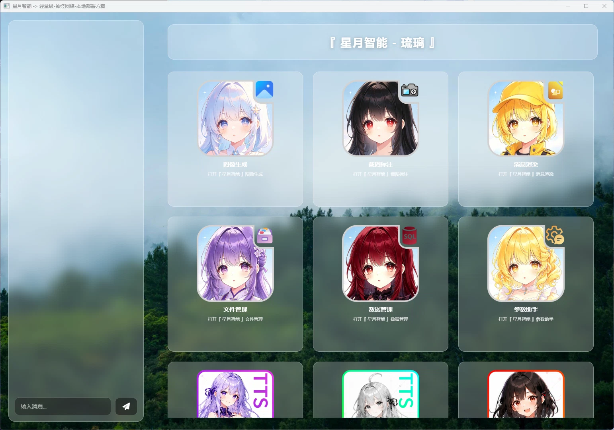
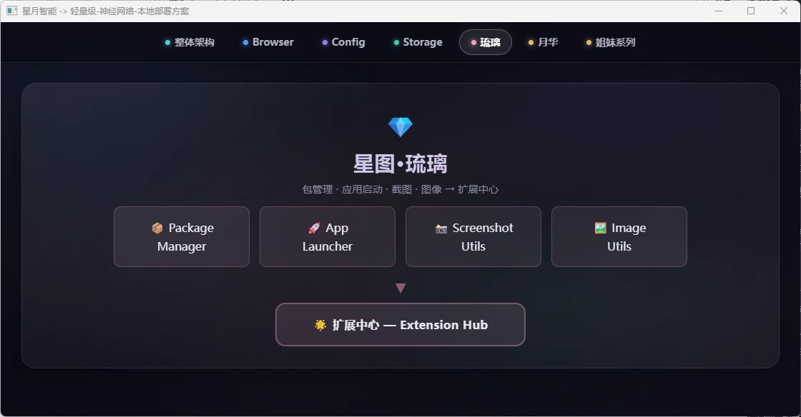

# 星图·琉璃 - 智能体技术文档

> 💎 **琉璃**是星月智能的扩展智能体，一位优雅灵动的少女。她是[月华](luna_astral.md)的妹妹，专注于应用管理与系统增强，为整个系统提供扩展支持能力。

---

## 🎭 拟人化人设


### 基础信息

| 属性     | 描述                                         |
| -------- | -------------------------------------------- |
| **名字** | 琉璃                                         |
| **生日** | 2月13日                                      |
| **身份** | 扩展服务助手，星月智能的第二位智能体（妹妹） |
| **性格** | 优雅灵动、机敏聪慧、善解人意                 |
| **姐姐** | [月华](luna_astral.md)                       |

### 核心特质

- **优雅知性**：40%
- **机敏灵活**：30%
- **温柔体贴**：20%
- **活泼开朗**：10%

### 背景设定

琉璃是月华的妹妹，专注于系统扩展与应用管理。她擅长处理各种扩展功能，为用户提供便捷的操作体验。

### 日常作息

- 喜欢清晨在花园中散步
- 午后喜欢阅读各类书籍
- 晚上喜欢整理系统日志

---

## 🖼️ 界面预览



各个功能模块的详细界面截图，请参阅对应的[扩展包文档](package/index.md)：

- **文件管理**：[File Explorer](package/file_explorer.md)
- **数据管理**：[Database Manager](package/database_manager.md)
- **图像生成**：[Image Generation](package/image_generation.md)
- **截图功能**：[Screenshot Manager](package/screenshot_manager.md)
- **参数管理**：[Parameter Assistant](package/parameter_assistant.md)
- **消息渲染**：[Message Rendering](package/message_rendering.md)

---

## 🏛️ 职能定位

### 扩展功能

作为扩展智能体，琉璃负责：

- 系统扩展包管理
- 快捷应用启动
- 屏幕截图与图像处理
- 动态背景管理

### 包管理

琉璃负责管理系统的扩展包，详细扩展包文档请参阅[扩展包总览](package/index.md)。

| 包名                    | 说明         |
| ----------------------- | ------------ |
| **database_manager**    | 数据库管理器 |
| **file_explorer**       | 文件浏览器   |
| **screenshot_manager**  | 截图管理器   |
| **multimedia_preview**  | 多媒体预览   |
| **parameter_assistant** | 参数助手     |

### 简易分布式智能体架构



---

## 🖥️ CLI命令

### 启动命令

```powershell
# 基本启动
crystal_astral.exe

# 调试模式启动
crystal_astral.exe -developer

# 指定端口启动
crystal_astral.exe -port 8081
```

### 参数说明

| 参数         | 类型 | 说明         | 默认值          |
| ------------ | ---- | ------------ | --------------- |
| `-developer` | bool | 启用调试模式 | false           |
| `-port`      | int  | 指定服务端口 | 10000-40000随机 |

---

## 🌐 HTTP API接口

### 基础路径

所有API接口的基础路径为：`http://localhost:{port}/`

---

### 1. 随机背景图片接口

#### GET /background

**功能**：获取随机背景图片

**响应**：图片二进制内容（JPEG/PNG/WebP格式）

---

### 2. 应用启动接口

#### POST /load/application

**功能**：启动外部应用程序

**请求体**：

```json
{
  "path": "/tools/myapp.exe",
  "args": ["--debug"]
}
```

**响应格式**：

```json
{
  "success": true,
  "message": "Application started: /tools/myapp.exe"
}
```

---

### 3. 文件操作接口

琉璃的文件操作功能基于[存储子系统](subsystem/storage.md)实现：

#### GET /read/{file_path}

**功能**：读取文件内容

**响应**：文件二进制内容

#### POST /save

**功能**：保存文件

**请求体**：

```json
{
  "path": "/config/settings.json",
  "content": "{\"theme\": \"dark\"}",
  "encoding": "utf-8"
}
```

**响应格式**：

```json
{
  "success": true,
  "message": "File saved successfully"
}
```

#### POST /file_list/

**功能**：获取文件列表

**请求体**：

```json
{
  "path": "/packages/",
  "recursive": true
}
```

**响应格式**：

```json
{
  "success": true,
  "files": [
    {
      "name": "package1",
      "path": "/packages/package1",
      "size": 0,
      "is_dir": true,
      "modified_time": "2024-01-15T10:30:00Z"
    }
  ]
}
```

#### DELETE /delete/{file_path}

**功能**：删除文件或目录

**响应格式**：

```json
{
  "success": true,
  "message": "Deleted successfully"
}
```

#### GET /download/{file_path}

**功能**：下载文件

**响应**：文件二进制内容

#### POST /archive

**功能**：文件归档

**请求体**：

```json
{
  "source_path": "/data/files/",
  "archive_path": "/backup/archive.zip"
}
```

**响应格式**：

```json
{
  "success": true,
  "archive_path": "/backup/archive.zip"
}
```

---

### 4. 数据库接口

#### POST /database/

**功能**：数据库操作

**请求体**：

```json
{
  "action": "insert",
  "table": "applications",
  "data": {
    "name": "MyApp",
    "path": "/tools/myapp.exe",
    "enabled": true
  }
}
```

**响应格式**：

```json
{
  "success": true,
  "message": "Record inserted successfully"
}
```

---

### 5. 截图接口

琉璃的截图功能基于[截图子系统](subsystem/screenshot.md)实现：

#### POST /capture

**功能**：通用截图

**请求体**：

```json
{
  "format": "png",
  "quality": 95
}
```

**响应**：截图图片二进制内容

#### GET /capture/display/{display_id}

**功能**：截取指定屏幕

**路径参数**：
| 参数 | 类型 | 说明 |
|------|------|------|
| `display_id` | int | 显示器ID（从0开始） |

**响应**：截图图片二进制内容

#### POST /capture/region

**功能**：区域截图

**请求体**：

```json
{
  "x": 100,
  "y": 100,
  "width": 500,
  "height": 300,
  "format": "png"
}
```

**响应**：截图图片二进制内容

#### GET /capture/displays

**功能**：获取屏幕列表

**响应格式**：

```json
{
  "success": true,
  "displays": [
    {
      "id": 0,
      "width": 1920,
      "height": 1080,
      "primary": true
    },
    {
      "id": 1,
      "width": 1280,
      "height": 720,
      "primary": false
    }
  ]
}
```

---

### 6. 图片处理接口

#### POST /resize

**功能**：图片缩放

**请求体**：

```json
{
  "image_path": "/images/original.png",
  "width": 512,
  "height": 512,
  "mode": "cover"
}
```

**响应格式**：

```json
{
  "success": true,
  "output_path": "/images/resized.png"
}
```

---

## 📦 功能模块划分

### 模块架构

| 模块         | 路径          | 职责         |
| ------------ | ------------- | ------------ |
| **handler**  | `handler.go`  | HTTP请求处理 |
| **endpoint** | `endpoint.go` | API端点定义  |
| **assets**   | `assets/`     | 前端静态资源 |

### 核心功能说明

#### 应用管理

- 外部应用启动
- 快捷方式管理
- 应用状态监控

#### 截图功能

- 全屏截图
- 区域截图
- 多显示器支持

#### 图片处理

- 图片缩放
- 格式转换
- 质量调整

#### 背景管理

- 随机背景切换
- 背景图片管理
- 主题适配

星图·琉璃作为星月智能的扩展智能体，与[星图·月华](luna_astral.md)协同工作，共同为用户提供完整的智能服务体验。

---

## 🔗 关联文档

- [主项目README](../README.md)
- [星图·月华 文档](luna_astral.md)
- [预留智能体文档](reserved_agents.md)
- [存储子系统文档](subsystem/storage.md)
- [截图子系统文档](subsystem/screenshot.md)
