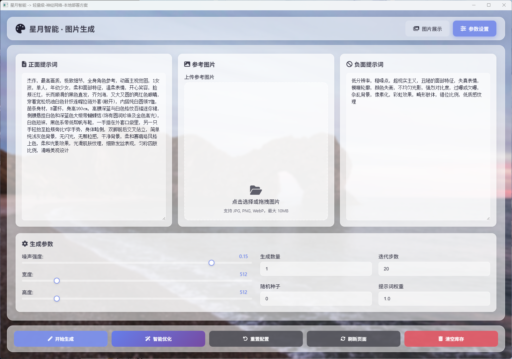
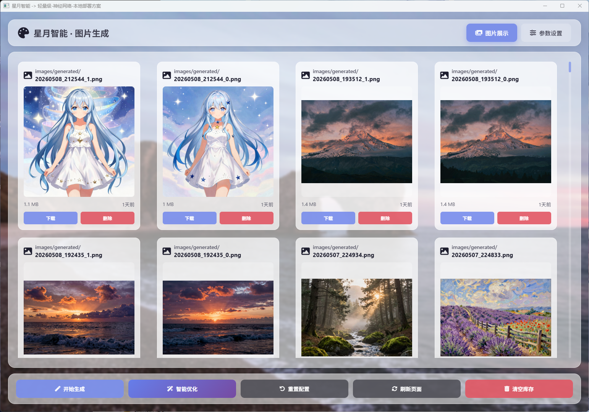

# Image Generation 图像生成组件

> 🎨 **Image Generation** 组件提供AI图像生成界面，包含正向提示词和负向提示词管理功能。

---

## 📁 文件结构

```
image_generation/
├── index.html           # 生成界面主页面
├── script.js            # 生成逻辑脚本
├── styles.css           # 界面样式
├── positive_prompt.md   # 正向提示词模板
└── negative_prompt.md   # 负向提示词模板
```

---

## 🎯 功能特性

### 提示词管理

- **正向提示词**：描述期望生成的图像内容
- **负向提示词**：排除不希望出现的元素
- 提示词模板保存与加载
- 常用提示词快捷标签

### 生成控制

- 图像尺寸设置（宽度、高度）
- 生成步数调整
- CFG Scale配置
- 采样器选择

### 预设模板

组件内置常用提示词模板，涵盖：
- 人物肖像
- 风景画
- 动漫风格
- 写实风格
- 艺术风格

---

## 🔧 使用方式

### HTML引用

```html
<!-- 引入图像生成组件 -->
<iframe src="/package/image_generation/index.html" width="100%" height="700"></iframe>
```

### 触发生成

```javascript
const iframe = document.querySelector('iframe');
iframe.contentWindow.postMessage({
    type: 'generate',
    params: {
        prompt: 'beautiful anime girl',
        negative_prompt: 'blurry, low quality',
        width: 512,
        height: 512,
        steps: 30,
        cfg_scale: 7.5
    }
}, '*');
```

### 接收结果

```javascript
window.addEventListener('message', (event) => {
    if (event.data.type === 'generation_complete') {
        const imagePath = event.data.image_path;
        console.log('Generated image:', imagePath);
    }
});
```

---

## 📡 接口协议

### 请求消息

| 消息类型 | 说明 | 参数 |
|----------|------|------|
| `generate` | 开始生成 | `GenerateParams` |
| `cancel` | 取消生成 | 无 |
| `save_template` | 保存模板 | `{ name: string, prompt: string, negative: string }` |

### GenerateParams

```typescript
interface GenerateParams {
    prompt: string;          // 正向提示词
    negative_prompt?: string; // 负向提示词
    width: number;           // 图像宽度
    height: number;          // 图像高度
    steps: number;          // 生成步数
    seed?: number;           // 随机种子
    cfg_scale?: number;      // CFG缩放
    sampler?: string;        // 采样器名称
}
```

### 响应消息

| 消息类型 | 说明 | 数据格式 |
|----------|------|----------|
| `generation_start` | 开始生成 | `{ task_id: string }` |
| `generation_progress` | 生成进度 | `{ task_id: string, progress: number }` |
| `generation_complete` | 生成完成 | `{ task_id: string, image_path: string }` |
| `generation_error` | 生成错误 | `{ task_id: string, error: string }` |

---

## 📝 提示词编写指南

### 正向提示词

```markdown
# 示例：动漫女孩
masterpiece, best quality, 1girl, anime style, long hair, blue eyes, school uniform, smile

# 示例：风景
landscape, mountain, sunset, golden hour, detailed, 8k
```

### 负向提示词

```markdown
# 通用负向提示词
lowres, bad anatomy, bad hands, text, error, missing fingers, extra digit
blurry, worst quality, low quality, normal quality, jpeg artifacts
```

---

## 🎨 界面预览





Image Generation组件是[扩展包](../index.md)的一部分，由[月华智能体](../luna_astral.md)提供AI图像生成功能支持。

---

## 🔗 关联文档

- [扩展包总览](index.md)
- [星图·月华 文档](../luna_astral.md)
- [主项目README](../README.md)