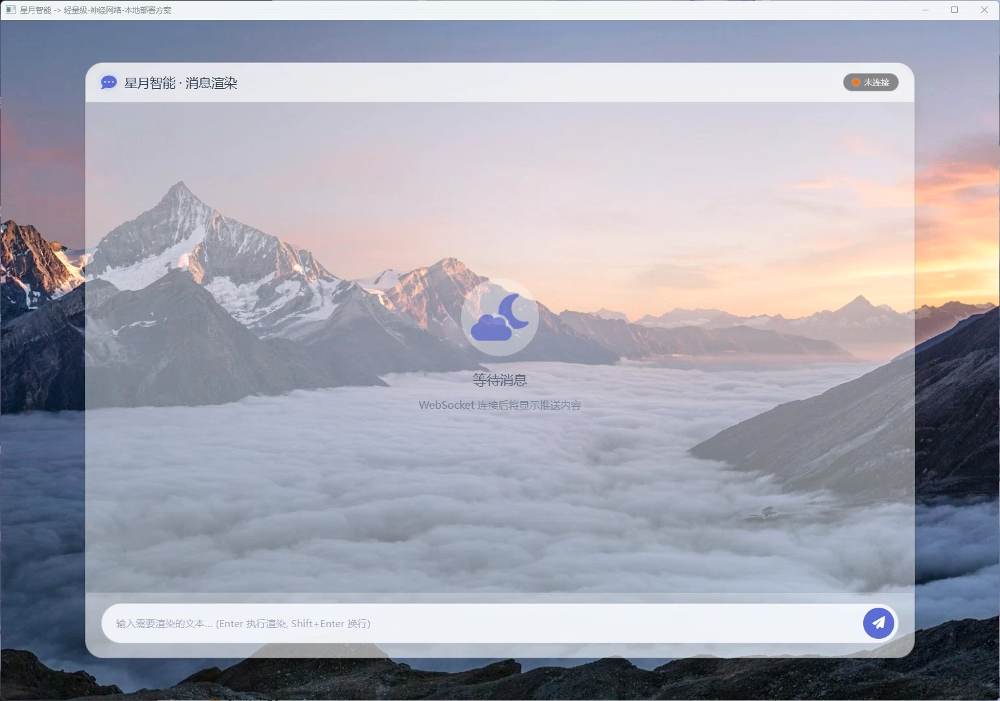

# Message Rendering 消息渲染组件

> 💬 **Message Rendering** 组件提供富文本消息的展示功能，支持Markdown渲染、代码高亮和多媒体内容。

---

## 🎨 界面预览



- 消息气泡式展示
- 左侧头像 + 右侧内容布局
- 支持深色/浅色主题
- 平滑的动画过渡

---

## 📁 文件结构

```
message_rendering/
├── index.html   # 渲染组件主页面
├── script.js    # 渲染逻辑脚本
├── styles.css   # 消息样式
└── table.css    # 表格样式
```

---

## 🎯 功能特性

### 内容渲染

- **Markdown解析**：支持标准Markdown语法
- **代码高亮**：支持多种编程语言语法高亮
- **数学公式**：支持KaTeX数学公式渲染
- **ECharts图表**：支持内嵌ECharts图表
- **Mermaid图表**：支持Mermaid流程图、时序图

### 消息类型

| 类型 | 说明 | 渲染效果 |
|------|------|----------|
| `text` | 普通文本 | 纯文本显示 |
| `markdown` | Markdown | 格式化渲染 |
| `code` | 代码块 | 语法高亮 |
| `image` | 图片 | 图片展示 |
| `chart` | 图表 | ECharts渲染 |

### 交互功能

- 代码复制按钮
- 图片放大预览
- 链接新窗口打开
- 消息翻译（待实现）

---

## 🔧 使用方式

### HTML引用

```html
<!-- 引入消息渲染组件 -->
<iframe src="/package/message_rendering/index.html" width="100%" height="500"></iframe>
```

### 渲染消息

```javascript
const iframe = document.querySelector('iframe');
iframe.contentWindow.postMessage({
    type: 'render',
    content: {
        type: 'markdown',
        text: '# Hello\n\nThis is **bold** and *italic* text.\n\n```python\nprint("Hello")\n```'
    }
}, '*');
```

### 完整消息示例

```javascript
// 渲染包含多种元素的消息
iframe.contentWindow.postMessage({
    type: 'render',
    content: {
        type: 'markdown',
        text: `
# 技术报告

这是一个图表示例：

\`\`\`mermaid
pie "月华" : 65
pie "琉璃" : 25
pie "其他" : 10
\`\`\`

代码示例：

\`\`\`go
func main() {
    fmt.Println("Hello from 月华!")
}
\`\`\`
`
    }
}, '*');
```

---

## 📡 接口协议

### 请求消息

| 消息类型 | 说明 | 参数 |
|----------|------|------|
| `render` | 渲染消息 | `MessageContent` |
| `clear` | 清空内容 | 无 |
| `scroll_to_bottom` | 滚动到底部 | 无 |

### MessageContent

```typescript
interface MessageContent {
    type: 'text' | 'markdown' | 'code' | 'image';
    text: string;           // 文本内容
    language?: string;     // 代码语言（type为code时）
    src?: string;          // 图片地址（type为image时）
}
```

### 响应消息

| 消息类型 | 说明 | 数据格式 |
|----------|------|----------|
| `rendered` | 渲染完成 | `{ height: number }` |
| `code_copied` | 代码已复制 | 无 |
| `image_clicked` | 图片被点击 | `{ src: string }` |

---

Message Rendering组件是[扩展包](../index.md)的一部分，为[星图·月华](../lunar_astral.md)提供富文本消息渲染功能支持。

---

## 🔗 关联文档

- [扩展包总览](index.md)
- [星图·月华 文档](../lunar_astral.md)
- [根目录文档](../../README.md)
