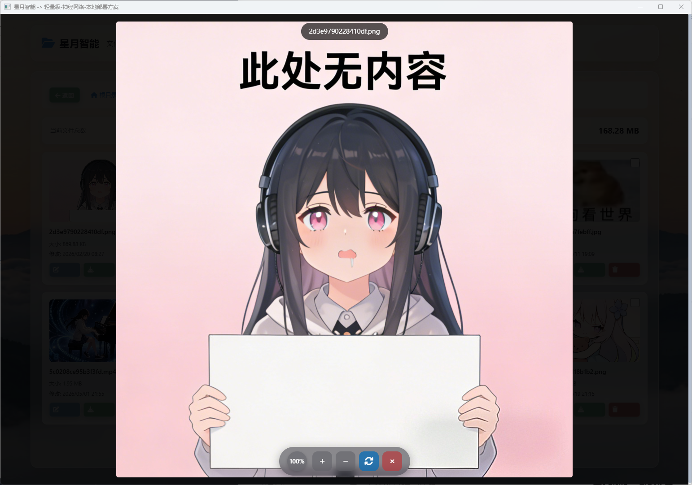

# Multimedia Preview 多媒体预览组件

> 🎬 **Multimedia Preview** 组件提供音视频和图片的多媒体内容预览功能。

---

## 🎨 界面预览

### 图片预览



### 视频预览


---

## 📁 文件结构

```
multimedia_preview/
├── index.html   # 预览组件主页面
├── script.js    # 预览逻辑脚本
└── styles.css   # 预览界面样式
```

---

## 🎯 功能特性

### 图像预览

- 图片缩放与平移
- 全屏查看模式
- 图片信息显示（尺寸、格式、大小）
- 幻灯片播放模式

### 音频播放

- 波形可视化显示
- 播放/暂停控制
- 进度条拖拽
- 音量调节
- 播放速度调整

### 视频播放

- 多种格式支持
- 播放/暂停控制
- 全屏模式
- 进度条拖拽
- 音量与播放速度调节

### 支持的格式

| 类型 | 支持格式 |
|------|----------|
| 图像 | PNG, JPG, JPEG, GIF, WebP, SVG, BMP |
| 音频 | MP3, WAV, OGG, FLAC |
| 视频 | MP4, WebM, MKV |

---

## 🔧 使用方式

### HTML引用

```html
<!-- 引入多媒体预览组件 -->
<iframe src="/package/multimedia_preview/index.html" width="100%" height="600"></iframe>
```

### 预览图像

```javascript
const iframe = document.querySelector('iframe');
iframe.contentWindow.postMessage({
    type: 'preview',
    media: {
        type: 'image',
        src: '/images/photo.jpg',
        name: 'photo.jpg',
        size: 1024000
    }
}, '*');
```

### 预览音频

```javascript
iframe.contentWindow.postMessage({
    type: 'preview',
    media: {
        type: 'audio',
        src: '/audios/speech.mp3',
        name: '语音记录.mp3'
    }
}, '*');
```

### 预览视频

```javascript
iframe.contentWindow.postMessage({
    type: 'preview',
    media: {
        type: 'video',
        src: '/videos/demo.mp4',
        name: '演示视频.mp4'
    }
}, '*');
```

---

## 📡 接口协议

### 请求消息

| 消息类型 | 说明 | 参数 |
|----------|------|------|
| `preview` | 预览媒体 | `MediaInfo` |
| `play` | 播放 | 无 |
| `pause` | 暂停 | 无 |
| `stop` | 停止 | 无 |
| `fullscreen` | 全屏切换 | 无 |
| `set_volume` | 设置音量 | `{ volume: number }` |
| `set_speed` | 设置速度 | `{ speed: number }` |

### MediaInfo

```typescript
interface MediaInfo {
    type: 'image' | 'audio' | 'video';
    src: string;           // 媒体资源地址
    name?: string;        // 文件名
    size?: number;        // 文件大小（字节）
    width?: number;       // 图像/视频宽度
    height?: number;      // 图像/视频高度
    duration?: number;    // 媒体时长（秒）
}
```

### 响应消息

| 消息类型 | 说明 | 数据格式 |
|----------|------|----------|
| `loaded` | 加载完成 | `MediaInfo` |
| `play` | 开始播放 | 无 |
| `pause` | 暂停播放 | 无 |
| `ended` | 播放结束 | 无 |
| `error` | 加载错误 | `{ message: string }` |

---

- 图片：居中展示 + 底部缩略图栏
- 音频：波形图 + 播放控制条
- 视频：视频播放器 + 控制栏

---

Multimedia Preview组件是[扩展包](../index.md)的一部分，由[琉璃智能体](../crystal_astral.md)提供多媒体内容预览功能支持。

---

## 🔗 关联文档

- [扩展包总览](index.md)
- [星图·琉璃 文档](../crystal_astral.md)
- [主项目README](../README.md)