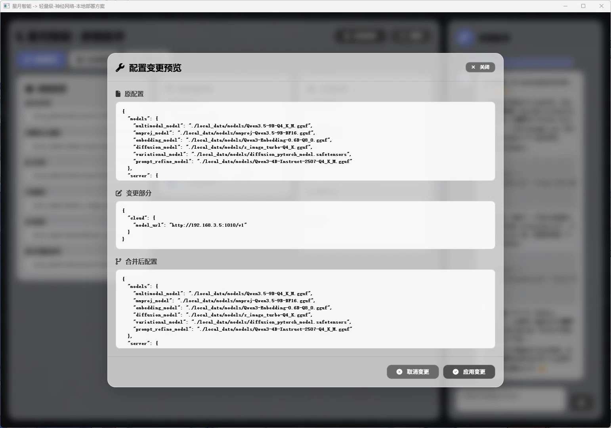

# Parameter Assistant 参数助手组件

> ⚙️ **Parameter Assistant** 组件提供参数配置辅助界面，帮助用户配置和调整各种系统参数。

---

## 🎨 界面预览



- 左侧：参数分组列表
- 右侧：参数配置面板
- 底部：保存/重置按钮

---

## 📁 文件结构

```
parameter_assistant/
├── index.html   # 助手主页面
├── script.js    # 参数逻辑脚本
└── styles.css   # 界面样式
```

---

## 🎯 功能特性

### 参数配置

- 参数分组管理
- 参数类型支持：
  - 数值输入（整数/浮点）
  - 开关切换
  - 下拉选择
  - 文本输入
  - 滑块调节
- 参数范围限制
- 参数验证

### 预设配置

- 内置常用配置模板
- 用户配置保存
- 配置导入/导出

### 实时预览

- 参数修改即时生效
- 预览效果展示
- 历史记录回溯

---

## 🔧 使用方式

### HTML引用

```html
<!-- 引入参数助手组件 -->
<iframe src="/package/parameter_assistant/index.html" width="100%" height="600"></iframe>
```

### 设置参数组

```javascript
const iframe = document.querySelector('iframe');
iframe.contentWindow.postMessage({
    type: 'set_parameters',
    groups: [
        {
            name: '模型设置',
            parameters: [
                {
                    key: 'temperature',
                    label: '温度参数',
                    type: 'slider',
                    value: 0.7,
                    min: 0,
                    max: 2,
                    step: 0.1
                },
                {
                    key: 'max_tokens',
                    label: '最大Token数',
                    type: 'number',
                    value: 1024,
                    min: 1,
                    max: 4096
                }
            ]
        }
    ]
}, '*');
```

### 监听参数变更

```javascript
window.addEventListener('message', (event) => {
    if (event.data.type === 'parameter_changed') {
        const { key, value } = event.data;
        console.log(`参数 ${key} 更新为:`, value);
    }
});
```

---

## 📡 接口协议

### 请求消息

| 消息类型 | 说明 | 参数 |
|----------|------|------|
| `set_parameters` | 设置参数组 | `ParameterGroup[]` |
| `get_parameters` | 获取当前配置 | 无 |
| `reset_parameters` | 重置为默认值 | 无 |
| `export_config` | 导出配置 | 无 |
| `import_config` | 导入配置 | `{ config: string }` |

### ParameterGroup

```typescript
interface ParameterGroup {
    name: string;              // 分组名称
    parameters: Parameter[];   // 参数列表
}

interface Parameter {
    key: string;               // 参数键名
    label: string;             // 显示名称
    type: 'number' | 'slider' | 'switch' | 'select' | 'text';
    value: any;               // 当前值
    default?: any;            // 默认值
    min?: number;             // 最小值
    max?: number;             // 最大值
    step?: number;            // 步进值
    options?: string[];       // 下拉选项
}
```

### 响应消息

| 消息类型 | 说明 | 数据格式 |
|----------|------|----------|
| `parameter_changed` | 参数变更 | `{ key: string, value: any }` |
| `config_exported` | 配置导出 | `{ config: string }` |
| `config_imported` | 配置导入 | 无 |

---

Parameter Assistant组件是[扩展包](../index.md)的一部分，由[月华智能体](../luna_astral.md)提供参数配置辅助功能支持。

---

## 🔗 关联文档

- [扩展包总览](index.md)
- [星图·月华 文档](../luna_astral.md)
- [主项目README](../README.md)