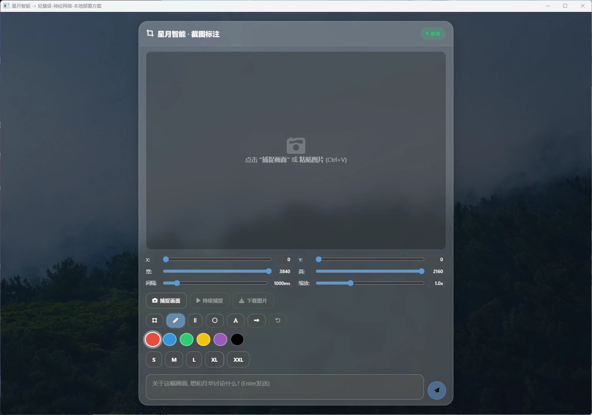

# Screenshot Manager 截图管理器

> 📸 **Screenshot Manager** 组件提供屏幕截图的管理功能，支持截图预览、编辑和保存。

---

## 🎨 界面预览



- 缩略图网格展示
- 顶部工具栏
- 截图详情面板

---

## 📁 文件结构

```
screenshot_manager/
├── index.html   # 截图管理器主页面
├── script.js    # 截图逻辑脚本
└── styles.css   # 界面样式
```

---

## 🎯 功能特性

### 截图功能

- 全屏截图
- 区域截图
- 窗口截图
- 定时截图

### 截图管理

- 截图列表展示
- 缩略图预览
- 截图命名与标记
- 批量删除

### 编辑功能

- 基础标注（箭头、框选、文字）
- 模糊处理
- 裁剪
- 撤销/重做

### 导出格式

支持导出为：PNG, JPG, WebP, BMP

---

## 🔧 使用方式

### HTML引用

```html
<!-- 引入截图管理器组件 -->
<iframe src="/package/screenshot_manager/index.html" width="100%" height="600"></iframe>
```

### 请求截图

```javascript
const iframe = document.querySelector('iframe');

// 请求全屏截图
iframe.contentWindow.postMessage({
    type: 'capture',
    mode: 'fullscreen'
}, '*');

// 请求区域截图
iframe.contentWindow.postMessage({
    type: 'capture',
    mode: 'region',
    region: { x: 100, y: 100, width: 500, height: 300 }
}, '*');
```

### 获取截图列表

```javascript
// 请求截图列表
iframe.contentWindow.postMessage({
    type: 'get_list'
}, '*');

// 接收响应
window.addEventListener('message', (event) => {
    if (event.data.type === 'screenshots_list') {
        console.log('截图列表:', event.data.screenshots);
    }
});
```

---

## 📡 接口协议

### 请求消息

| 消息类型 | 说明 | 参数 |
|----------|------|------|
| `capture` | 执行截图 | `CaptureOptions` |
| `get_list` | 获取列表 | 无 |
| `delete` | 删除截图 | `{ id: string }` |
| `save` | 保存截图 | `{ id: string, format: string }` |

### CaptureOptions

```typescript
interface CaptureOptions {
    mode: 'fullscreen' | 'region' | 'window';
    region?: {              // 区域截图时必填
        x: number;
        y: number;
        width: number;
        height: number;
    };
    windowId?: string;      // 窗口截图时必填
}
```

### 响应消息

| 消息类型 | 说明 | 数据格式 |
|----------|------|----------|
| `capture_complete` | 截图完成 | `{ id: string, thumbnail: string }` |
| `screenshots_list` | 截图列表 | `{ screenshots: Screenshot[] }` |
| `deleted` | 删除完成 | `{ id: string }` |
| `error` | 操作错误 | `{ message: string }` |

### Screenshot

```typescript
interface Screenshot {
    id: string;             // 唯一标识
    thumbnail: string;      // 缩略图Base64
    path: string;          // 文件路径
    created_at: string;    // 创建时间
    size: {                // 尺寸
        width: number;
        height: number;
    };
    format: string;         // 图片格式
}
```

---

## 🔗 关联文档

- [扩展包总览](index.md)
- [星图·琉璃 文档](../crystal_astral.md)
- [星图·月华 文档](../luna_astral.md)
- [主项目README](../README.md)