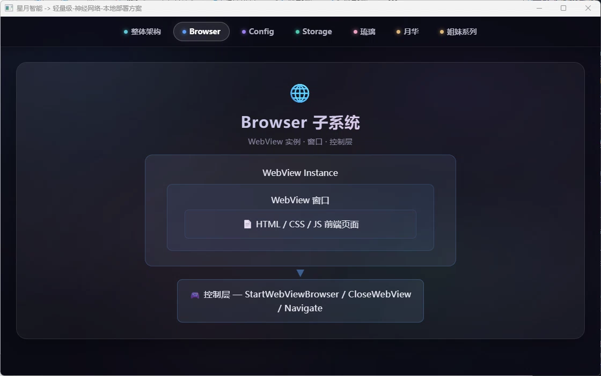

# Browser子系统 - 浏览器集成方案文档

> 🌐 **Browser子系统**是星月智能的浏览器集成模块，负责管理WebView窗口、网页交互和资源加载。

---

## 🏗️ 架构设计

### WebView集成架构



---

## 📋 API接口

### 核心函数

#### 1. StartWebViewBrowser

**功能**：启动WebView浏览器窗口

**参数**：
| 参数 | 类型 | 说明 |
|------|------|------|
| `url` | string | 要导航的URL地址 |

**返回值**：无

**示例**：
```go
browser.StartWebViewBrowser("http://localhost:8080")
```

#### 2. CloseWebView

**功能**：安全关闭WebView窗口

**参数**：无

**返回值**：无

**示例**：
```go
browser.CloseWebView()
```

#### 3. IsWebViewSupported

**功能**：检查当前平台是否支持WebView

**参数**：无

**返回值**：
| 返回值 | 类型 | 说明 |
|--------|------|------|
| `supported` | bool | 是否支持WebView |

**支持平台**：
| 平台 | 支持状态 |
|------|----------|
| Windows | ✅ 支持 |
| macOS | ✅ 支持 |
| Linux | ✅ 支持 |

**示例**：
```go
if browser.IsWebViewSupported() {
    browser.StartWebViewBrowser("http://localhost:8080")
}
```

---

## 🔄 网页交互机制

### JavaScript桥接

WebView支持JavaScript与Go代码的双向通信：

```go
// 注册JavaScript回调
w.Bind("nativeFunction", func(args ...interface{}) interface{} {
    // 处理JavaScript调用
    return "Response from Go"
})
```

### 资源加载机制

| 资源类型 | 加载方式 | 说明 |
|----------|----------|------|
| 静态资源 | 嵌入式加载 | HTML/CSS/JS打包进可执行文件 |
| 动态资源 | HTTP请求 | 通过服务器获取 |
| 本地文件 | 文件协议 | `file://` 协议访问本地资源 |

### 服务等待机制

WebView启动前会等待后端服务就绪：

```
启动WebView
    │
    ▼
等待HTTP服务就绪（最多10秒）
    │
    ├── TCP连接检测（每300ms）
    ├── 连接成功 → 继续启动
    └── 超时(10s) → 跳过检测继续启动
    │
    ▼
创建WebView实例
    │
    ▼
导航到目标URL
```

---

## 📁 目录结构

```
subsystem/browser/
├── webView.go    # WebView核心功能
├── execute.go    # 执行相关功能
├── type.go       # 类型定义
├── go.mod
└── go.sum
```

---

## 🔧 使用示例

### 启动WebView

```go
package main

import (
    "browser"
    "log"
)

func main() {
    // 检查WebView支持
    if !browser.IsWebViewSupported() {
        log.Fatal("当前平台不支持WebView")
    }
    
    // 在goroutine中启动WebView（避免阻塞主线程）
    go func() {
        browser.StartWebViewBrowser("http://localhost:8080")
    }()
    
    // 启动HTTP服务...
}
```

### 安全关闭

```go
// 监听系统信号
quit := make(chan os.Signal, 1)
signal.Notify(quit, os.Interrupt, syscall.SIGTERM)

<-quit

// 关闭WebView
browser.CloseWebView()
```

---

## 🔗 关联文档

- [主项目README](../../README.md)
- [星图·月华 文档](../luna_astral.md)
- [星图·琉璃 文档](../crystal_astral.md)
- [存储子系统文档](storage.md)
- [配置子系统文档](config.md)
- [预留智能体文档](../reserved_agents.md)