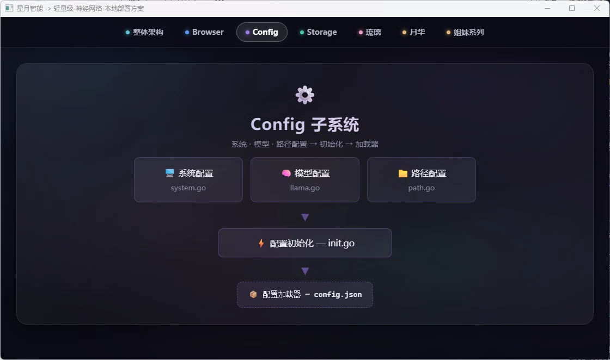

# Config子系统 - 配置管理机制文档

> ⚙️ **Config子系统**是星月智能的配置管理模块，负责管理系统配置、模型配置、路径配置等核心配置项。

---

## 🏗️ 架构设计

### 配置管理架构




---

## 📋 配置项说明

### 系统配置

| 配置项 | 类型 | 默认值 | 说明 |
|--------|------|--------|------|
| `Developer` | bool | false | 调试模式开关 |
| `ModelReady` | int | 0 | 模型就绪状态 |
| `MaxModelAmount` | int | 0 | 最大模型数量 |
| `ServerAddress` | []string | [] | 服务器地址列表 |

### 模型配置

| 配置项 | 类型 | 默认值 | 说明 |
|--------|------|--------|------|
| `ModelPortMap` | map[string]int | {} | 模型端口映射 |
| `CloudModelUrl` | string | "" | 云端模型URL |

### 路径配置

| 配置项 | 类型 | 默认值 | 说明 |
|--------|------|--------|------|
| `LocalDir` | string | "./local_data" | 本地数据目录 |
| `ModelDir` | string | "./models" | 模型目录 |

### WebView配置

| 配置项 | 类型 | 默认值 | 说明 |
|--------|------|--------|------|
| `WebViewTitle` | string | "星月智能" | 窗口标题 |
| `WebViewWidth` | int | 1200 | 窗口宽度 |
| `WebViewHeight` | int | 800 | 窗口高度 |
| `WebViewMinWidth` | int | 800 | 最小宽度 |
| `WebViewMinHeight` | int | 600 | 最小高度 |
| `WebViewResizable` | bool | true | 是否可调整大小 |

### 端口配置

| 配置项 | 类型 | 默认值 | 说明 |
|--------|------|--------|------|
| `APIPort` | int | 0 | API服务端口（0表示随机） |
| `TTSUrl` | string | "" | TTS服务地址 |

### 图像配置

| 配置项 | 类型 | 默认值 | 说明 |
|--------|------|--------|------|
| `ImageOutputDir` | string | "./images" | 图像输出目录 |
| `DefaultWidth` | int | 512 | 默认图像宽度 |
| `DefaultHeight` | int | 512 | 默认图像高度 |

### 扩散模型配置

| 配置项 | 类型 | 默认值 | 说明 |
|--------|------|--------|------|
| `DiffusionModel` | string | "" | 扩散模型路径 |
| `DiffusionSteps` | int | 30 | 默认步数 |
| `DiffusionCFG` | float64 | 7.5 | CFG缩放 |

---

## 🔄 动态配置更新流程

### 配置加载流程

```
启动应用
    │
    ▼
加载默认配置
    │
    ▼
读取配置文件 (lunar_config.json)
    │
    ▼
合并命令行参数
    │
    ▼
初始化子系统配置
    │
    ▼
配置生效
```

### 配置文件格式

**配置文件路径**：`local_data/lunar_config.json`

```json
{
  "system": {
    "developer": false,
    "max_model_amount": 3
  },
  "model": {
    "cloud_model_url": "",
    "default_model": "qwen2-7b"
  },
  "path": {
    "local_dir": "./local_data",
    "model_dir": "./models"
  },
  "webview": {
    "title": "星月智能",
    "width": 1200,
    "height": 800,
    "resizable": true
  },
  "port": {
    "api_port": 0,
  },
  "image": {
    "output_dir": "./images",
    "default_width": 512,
    "default_height": 512
  },
  "diffusion": {
    "model": "./models/stable_diffusion",
    "steps": 30,
    "cfg_scale": 7.5
  }
}
```

### 动态更新机制

配置支持运行时动态更新：

1. **热更新**：修改配置文件后，系统自动检测并重新加载
2. **API更新**：通过API接口动态修改配置
3. **优先级**：命令行参数 > 配置文件 > 默认值

---

## 📁 目录结构

```
subsystem/config/
├── system.go      # 系统配置
├── model.go       # 模型配置 (llama.go)
├── path.go        # 路径配置
├── port.go        # 端口配置
├── webview.go     # WebView配置
├── image.go       # 图像配置
├── diffusion.go   # 扩散模型配置
├── init.go        # 配置初始化
├── go.mod
└── go.sum
```

---

## 🔧 使用示例

### 配置初始化

```go
func init() {
    // 初始化配置
    config.Initialize()
    
    // 加载配置文件
    config.LoadConfig("./local_data/lunar_config.json")
    
    // 应用命令行参数
    flag.Parse()
}
```

### 访问配置项

```go
// 检查调试模式
if *config.Developer {
    log.Println("调试模式已启用")
}

// 获取模型端口
config.ModelMapMutex.RLock()
port := config.ModelPortMap["qwen2-7b"]
config.ModelMapMutex.RUnlock()

// 获取本地目录路径
localDir := *config.LocalDir
```

### 修改配置

```go
// 修改配置项
*config.WebViewTitle = "新标题"

// 添加模型端口映射
config.ModelMapMutex.Lock()
config.ModelPortMap["new-model"] = 8888
config.ModelMapMutex.Unlock()
```

Config子系统为整个星月智能提供配置管理支持，与[存储子系统](storage.md)协作管理系统数据，为[浏览器子系统](browser.md)提供WebView配置参数。

---

## 🔗 关联文档

- [根目录文档](../../README.md)
- [星图·月华 文档](../lunar_astral.md)
- [存储子系统文档](storage.md)
- [浏览器子系统文档](browser.md)