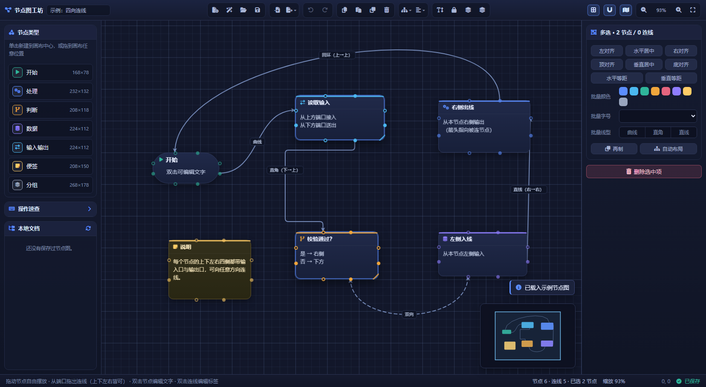

# 节点图工坊（`lunar.node-graph-studio`）

**Zero-LTP 包** —— 纯前端的节点图设计与制作工具。在琉璃的应用网格里点开即用，不需要后端、不需要构建步骤。

> 想直接看效果：`node test/serve.js`，然后打开它打印的地址；或按 F12 打开任一页面的控制台。
>
> 界面实拍（由 `node test/browser-check.js --shot test/screenshot.png` 自动生成，载入示例节点图后截图）：
>
> 

---

## 一、能做什么

| 需求 | 实现方式 |
|------|----------|
| **自由拖放节点** | 按住节点任意位置拖动，**逐帧实时跟随指针**（多选整组一起拖）；`Shift` 沿单轴移动；`Alt` 临时关闭吸附；默认「自由摆放 + 邻近节点对齐参考线」，栅格吸附默认关闭，需要位置量化时在顶栏或右栏一键开启 |
| **为节点连线** | 从任意端口的圆点拖到另一个端口的圆点即完成连接；同向投放会自动补一个反向端口；拖到**空白处**会弹出节点类型菜单，**顺手新建节点并直接连上** |
| **编写节点上的文字** | 双击节点正文就地编辑多行文字，**高度随内容自动收放**（加行变高、删行收紧，不会每敲一下就往上顶）；双击标题改标题；双击连线加标签；右栏检查器里也能改；选中后可用「高度贴合文字」一键按内容收紧或撑开；标题栏右侧按钮可折叠成一条标题条 |
| **正确显示连线的显示方向** | 箭头是独立的多边形，被 `translate` 到端口锚点、`rotate` 到曲线在该点的**切向角**，因此永远指向被连节点；支持终点箭头 / 双向箭头 / 无箭头 |
| **可向四面八方连接** | 每个节点的**上、下、左、右四侧都各有一个输入口和一个输出口**（默认 8 个端口），任意 4×4 侧向组合都能连；同侧端口数量可用 `+ / −` 增减，多端口沿该侧均匀排开 |

配套能力：画布缩放/平移/适应视图、缩略图、撤销重做、复制粘贴再制、对齐与等距分布、一键分层自动布局、三种线型（曲线 / 直角 / 直线）、虚线、连线颜色、端口增删、锁定位置、层序调整、折叠正文、右键菜单、快捷键、JSON 工程导入导出、SVG 矢量导出、PNG 位图导出、保存到 `local_data` 与浏览器草稿自动保存。

### 界面上的两个"看起来不知道是什么"的元素

| 元素 | 说明 |
|---|---|
| 卡片**顶边的彩色条** | **纯装饰，没有任何交互功能**。它取节点自身的配色（在右栏「颜色」里改），用来一眼区分节点类型/分组。做成满宽、跟随卡片圆角，就是"卡片顶边带色"。胶囊形节点不显示它，类型色由头部图标承担。不想看到它的话删掉 `css/canvas.css` 里的 `.node-accent` 规则即可，其余功能不受影响。 |
| 卡片右下角的小三角 | 拖动它可以调整节点尺寸（`Alt` 临时关闭吸附）。鼠标悬停或选中时才显现。 |

---

## 二、目录结构

```text
lunar.node-graph-studio/
├── metadata.json          # LTPX 包元数据（tags: Zero-LTP，background_retention: true）
├── package.json           # 仅为「Node 侧测试脚本能 import 同一批 ES 模块」而声明 type: module
├── index.html             # 页面骨架（只提供容器，界面由 JS 按声明式命令表构建）
├── icon.svg               # 包图标
├── css/
│   ├── tokens.css         # 设计变量、骨架、按钮、菜单、弹窗、提示条、状态栏
│   ├── canvas.css         # 画布、栅格、节点、端口、连线、叠加层、就地编辑器、缩略图
│   └── panels.css         # 左栏（节点类型 / 速查 / 本地文档）与右栏检查器控件
├── js/
│   ├── core/              # 纯逻辑（无 DOM，可在 Node 中测试）
│   │   ├── geometry.js    #   向量 / 矩形 / 贝塞尔采样 / 折线化简
│   │   ├── snap.js        #   栅格吸附 + 对齐参考线
│   │   ├── ports.js       #   端口模型与全部连线合法性规则
│   │   ├── router.js      #   连线路由与方向（曲线 / 直角 / 直线）
│   │   ├── text.js        #   文字度量与换行（SVG/PNG 导出与渲染共用）
│   │   └── ids.js
│   ├── model/             # 数据模型（无 DOM）
│   │   ├── document.js    #   文档形态、清洗/夹取、信任边界
│   │   ├── graph.js       #   节点/连线/端口增删改与不变量
│   │   ├── palette.js     #   节点类型预设、配色、尺寸下限
│   │   ├── history.js     #   撤销/重做（整体快照）
│   │   └── layout.js      #   分层自动布局
│   ├── app/               # 应用层（无 DOM）
│   │   ├── store.js       #   单一状态源 + 主题事件总线
│   │   └── commands.js    #   全部可撤销操作
│   ├── view/              # 视图层（投影模型 → DOM/SVG）
│   │   ├── viewport.js    #   世界⇄屏幕换算、缩放平移、适配、栅格背景
│   │   ├── renderer.js    #   按 id 差量复用节点/连线/标签，瞬时态覆盖层
│   │   ├── textedit.js    #   就地文字编辑（正文 / 标题 / 连线标签）
│   │   └── minimap.js     #   缩略图（Canvas 2D）
│   ├── ui/                # 面板与控件
│   │   ├── dom.js         #   DOM 小工具、提示条、弹窗、文件下载
│   │   ├── toolbar.js     #   顶栏（声明式命令表）
│   │   ├── palette.js     #   左栏
│   │   ├── inspector.js   #   右栏属性检查器
│   │   ├── contextmenu.js #   弹出菜单（顶栏下拉与右键共用）
│   │   └── statusbar.js   #   底栏
│   ├── io/
│   │   ├── files.js       #   琉璃文件端点封装（永不抛异常）
│   │   ├── persistence.js #   草稿（localStorage）+ 磁盘（local_data）
│   │   └── exportfile.js  #   JSON / SVG / PNG 导出与导入
│   ├── interaction.js     # 画布交互状态机（拖节点 / 拉线 / 框选 / 平移 / 缩放）
│   └── main.js            # 组合根：装配、命令表、快捷键、订阅
└── test/
    ├── run.js             # Node 入口：静态导入检查 + 75 项逻辑用例
    ├── browser-check.js   # 无头浏览器入口：27 项 DOM 端到端 + 截图
    ├── serve.js           # 开发预览服务器（复刻琉璃的 /file/* 端点）
    ├── dom.html + dom.js + dom-helpers.js   # DOM 端到端用例
    ├── index.html + browser.js              # 浏览器里跑逻辑用例
    ├── check-imports.js   # 静态导入图检查
    ├── harness.js         # 极简测试框架（断言 + 汇总）
    └── suites/            # 逻辑用例：router / ports / model
```

**分层原则**：`core` 与 `model` 完全不碰 DOM，`view` 只读模型、从不改数据，所有改动都经 `app/commands` → `model/graph` → `store` 事件 → 视图重绘。因此最难的几何与规则逻辑可以在 Node 里直接跑测试。

---

## 三、数据模型

```jsonc
// 节点
{
  "id": "n_...", "type": "process",        // 预设决定默认尺寸/配色/图标
  "x": 120, "y": 80, "w": 232, "h": 132,   // 世界坐标与尺寸（有上下限）
  "title": "处理步骤", "text": "正文文字",
  "color": "#5b8dff", "shape": "round",    // round | rect | pill | note
  "fontSize": 13, "locked": false, "collapsed": false,
  "ports": { "in": { "top": 1, "right": 1, "bottom": 1, "left": 1 },
             "out": { "top": 1, "right": 1, "bottom": 1, "left": 1 } }
}

// 连线：恒为 out → in
{
  "id": "e_...",
  "from": { "node": "n_a", "dir": "out", "side": "right", "index": 0 },
  "to":   { "node": "n_b", "dir": "in",  "side": "left",  "index": 0 },
  "style": "bezier",                        // bezier | ortho | straight
  "arrow": "to",                            // to | both | none
  "dashed": false, "label": "是", "color": null
}
```

**关键设计**：端口是**纯身份**（节点 + 方向 + 侧 + 下标），坐标不入库 —— 位置由「节点几何 + 该侧端口数量」推导。所以移动/缩放节点后端口自动跟随，也不存在需要同步的冗余坐标。四个不变量由 `model/document.js` 的清洗器保证，任何外部来源（磁盘 JSON、剪贴板、导入文件）都先过一遍：

1. 连线恒为 `out → in`；
2. 两端必须指向存在的节点，且下标在该侧该方向的端口数量范围内（越界收敛、无端口则丢弃）；
3. 坐标/尺寸/缩放夹取到安全区间，枚举回落默认值，重复 id 与重复连线去重；
4. `color` 只接受十六进制或 `rgb()/rgba()`，其它一律回落预设色值。

---

## 四、「四面八方连接」的规则

- 每个节点四侧各有 1 个输入口与 1 个输出口，**开箱即可向任意方向连线**；同侧的输入口排在输出口之前，沿该侧均匀分布（不重叠）。
- 拖拽的连接规则（`core/ports.js#resolveConnection`，全部有单元测试）：

| 起点端口 | 落点端口 | 结果 |
|---|---|---|
| 输出 | 输入 | 直接成线（尾部 = 输出，头部 = 输入） |
| 输入 | 输出 | 反着拖也能连，尾部/头部自动纠正 |
| 输出 | 输出 | 给落点节点**同侧补一个输入口**后成线 |
| 输入 | 输入 | 给起点节点**同侧补一个输出口**后成线 |
| 同一端口 | — | 拒绝 |
| 已有同向连线 | — | 拒绝（提示「这两个端口之间已有连线」） |
| 落在空白处 | — | 弹出节点类型菜单，新建节点后**自动挑一个能连的端口连上** |

- 端口数量减少时，越界连线自动收敛下标、无端口可用的连线自动清理。

---

## 五、连线方向是怎么保证的

`core/router.js` 对每种线型都返回统一结果 `{ d, points, start, end, startAngle, endAngle, mid }`：

- **出线/入线桩**：曲线从端口沿该侧朝外法向出发、沿反方向驶入目标端口。因此上/下/左/右四个方向连出来都不会穿进节点内部。
- **箭头角度取切线**：`endAngle` 是曲线在头部处的切向角，箭头 `rotate(endAngle)` 后必然指进被连节点；双向箭头用 `startAngle + 180°`。
- **直角折线**：首段方向 = 尾部朝外法向，末段方向 = 头部朝内法向。当直连会「折返」（例如上方端口连上方端口、目标在下方）时，自动改走**节点外侧的竖直车道**，避免竖线从自己的节点里穿过去。
- **同侧多条连线**：沿法向自动扇开，不会完全重叠。
- **自环**：控制点外伸长度放大，环画得开、箭头方向仍然正确。

这些不变量不是靠肉眼保证的：`test/suites/router.test.js` 对 **4×4 种侧向组合 × 三种线型**逐个断言「首段对齐朝外法向、末段对齐朝内法向」，`test/dom.js` 再在真实浏览器里断言箭头元素的 `rotate` 角度与目标端口法向一致。

---

## 六、快捷键

| 按键 | 作用 | 按键 | 作用 |
|---|---|---|---|
| 拖动节点 | 自由摆放（多选整组） | `空格` + 拖动 / 中键 | 平移画布 |
| `Shift` + 拖动 | 沿单轴移动 | 滚轮 | 以光标为中心缩放 |
| `Alt` + 拖动 | 临时关闭吸附 | `Ctrl+0` / `F` | 100% / 适应视图 |
| 拖动端口 | 向任意方向连线 | `Ctrl+=` / `Ctrl+-` | 放大 / 缩小 |
| 双击节点正文 | 编辑文字（`Ctrl+Enter` 结束） | `Ctrl+Z` / `Ctrl+Y` | 撤销 / 重做 |
| 双击节点标题 | 编辑标题（`Enter` 结束） | `Ctrl+C` / `X` / `V` / `D` | 复制 / 剪切 / 粘贴 / 再制 |
| 双击连线 | 编辑连线标签 | `Ctrl+A` | 全选 |
| 双击端口 | 同侧同向再加一个端口 | `Ctrl+S` | 保存到本地 |
| 空白处双击 / 右键 | 新建节点菜单 | `Delete` | 删除选中 |
| 拖动空白处 | 框选（`Shift` 追加） | `G` / `L` | 切换栅格 / 锁定位置 |
| 方向键 | 微移选中节点（`Shift` ×10） | `Esc` | 取消选择 / 关闭菜单 |

---

## 七、本地存储

| 通道 | 位置 | 说明 |
|---|---|---|
| 浏览器草稿 | `localStorage` 键 `node-graph-studio:autosave` | 改动后 1.2s 自动落盘，刷新/重开自动恢复；可在右栏关闭 |
| 磁盘 | `local_data/database/node_graph_studio/<名称>.json` | 经琉璃 `/file/write`（`X-File-Name: base64(路径)`、`X-Overwrite: true`）写入；左栏「本地文档」可列出、打开、删除 |
| 工程文件 | 浏览器下载 `.json` | 完整工程（含端口、线型、视口、设置），可再导入继续编辑 |
| 图 | `.svg` / `.png` | SVG 为矢量（`core/text.js` 负责换行，所见即所得）；PNG 按 2 倍分辨率绘制 |

后端不可用时（例如单独打开静态文件）只有磁盘通道失效，界面照常工作，草稿与导出不受影响。

---

## 八、自检

```bash
# 1) 逻辑用例（76 项）+ 静态导入图检查 —— 不需要浏览器
node test/run.js

# 2) 真实浏览器里的 DOM 端到端用例（33 项）+ 界面截图 —— 自动拉起预览服务器与无头 Edge
node test/browser-check.js            # 可加 --keep-open 保留浏览器、--verbose 看页面日志
node test/browser-check.js --shot test/screenshot.png    # 顺便刷新 README 里的界面实拍
node test/browser-check.js --eval "return NodeGraphStudio.store.graph.nodes.length"   # 临时探针

# 3) 纯浏览器自检页（在琉璃里打开包目录下的对应页面即可）
#    test/index.html  逻辑用例
#    test/dom.html    DOM 端到端用例
```

`test/check-imports.js` 会逐文件核对每条相对 `import` 是否真的可解析：浏览器里 import 路径写错的表现是整片 404、应用完全不启动，而 `node --check` 只验语法、查不出来 —— 这个检查就是为了把这类错误拦在提交前。

DOM 用例里有两组专门守回归的断言：

- **拖动**：拖动中节点 DOM 必须逐帧跟随指针（位移与指针 1:1，允许 2px 误差）、开栅格吸附后按栅格量化但不得停在原地、拖角改尺寸实时跟随、整次拖动只写 1 条历史且可撤销。
- **节点高度**：一行文字贴合后必须**收紧**（不是变大）、连续调用 4 次高度必须完全不变、文字变多/变少要跟着变高/变矮、就地编辑时内容不变则反复输入不得长高、折叠收成标题栏且展开后回到内容高度。

---

## 九、设计取舍与已知边界

- **要量文字高度，只能量"文字本身"**（`renderer.measureContentHeight`）：不能读 `.node-text` 的 `scrollHeight`。它是被 flex 拉伸填满当前高度的元素，`scrollHeight` 天然 ≥ 当前高度，于是"所需高度"必然大于当前高度 ——「高度贴合文字」每点一次就把卡片撑高十几个像素、打字时每帧再长 2px，都是这一处造成的。现在用一个与 `.node-text` 同排版规则的**离屏探针**测量，结果只取决于「文字 + 可用宽度 + 字号」，与节点当前高度无关，因此可增可减且不会自激。为此 `.node-text` 与就地编辑器保持完全相同的盒模型（同内边距、无边框），否则换行结果对不上、测量就会偏差。
- **撤销栈用整体快照**：节点图规模有限（数百节点），快照换来的是「不可能出现半吊子状态」；拖拽过程不入栈，只在松手时提交一条。
- **拖动默认不量化位置**：位置按 20px 一跳会让人以为「拖不动」。因此默认自由摆放，只保留「与**邻近**节点对齐」的参考线吸附（画布另一头的节点不会把你猛拽过去）；`Alt` 可临时全部关掉。
- **全量渲染与瞬时态渲染共用一帧、且可被升级**（`main.js#scheduleRender`）：交互层每帧会先广播 `ui` 再请求重绘，如果两者各占一个 `requestAnimationFrame` 句柄、先到者把后者挡掉，就会表现成「拖节点时节点纹丝不动、松手才跳过去」。这是一条必须守住的调度不变量，DOM 用例里专门有一组断言守着它。
- **正交路由不做全局避障**：只保证「首段朝外、末段朝内」与「不穿过自己这两个节点」。同侧对连（如右侧连右侧且两节点很近）等极端布局会绕行，方向仍然正确，但不保证不与第三方节点相交。
- **直线样式不强制垂直入线**：直线就是直线，箭头沿连线指向端口——这是该线型应有的语义；需要「垂直入线」请用曲线或直角。
- **文字高度在编辑时自动增长**：新输入的文字会把节点撑高；从外部导入的、比节点更高的既有文字会被裁剪，可选中后点顶栏「高度适应文字」（或右键菜单）一次修正。
- **缩略图用 Canvas 2D 绘制节点色块**（不画文字），数百节点下依旧流畅。

---

## 十、相关文档

- [09 LTPX 协议 · 月华工具包](../../../docs/code-wiki/09-LTPX协议-月华工具包.md) —— Zero-LTP 分支、包元数据与 AtoA 链路
- [06 前端资源库](../../../docs/code-wiki/06-前端资源库.md) —— 包清单与前端共享资源约定
- [03 扩展系统 · 琉璃](../../../docs/code-wiki/03-扩展系统-钛宇-琉璃.md) —— `/file/*` 端点与前端包加载
