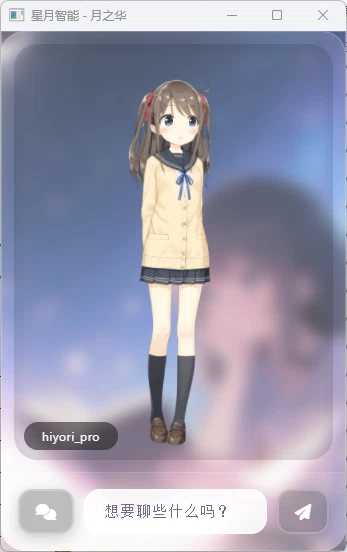
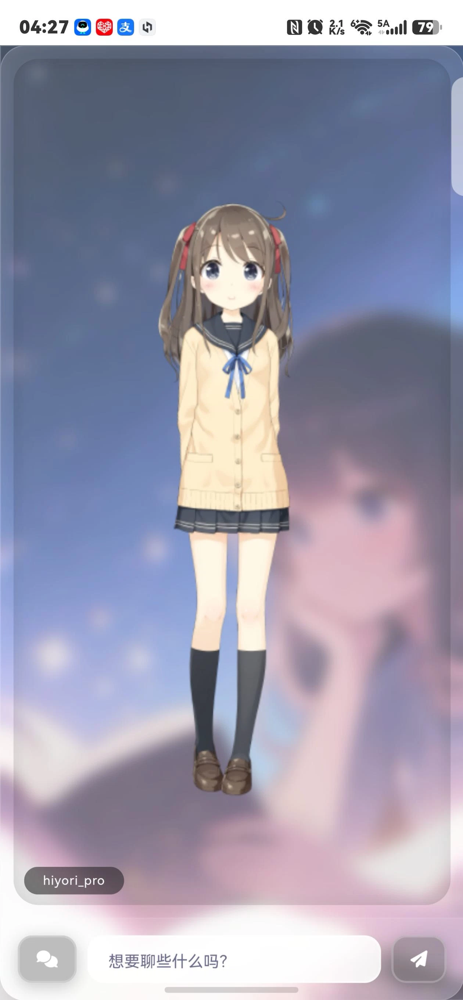

# 核心系统——星图·月华（lunar_astral）

AI 桌面智能体核心系统，集成多模态对话、Live2D 角色展示、TTS 语音合成与图像生成功能。

---

## 人格智能体：月华

**月华**寓意为「月亮的光华」——她的智慧如同月光般温柔而普照大地。

月华的智能体系根植于一个富有诗意的技术隐喻：如同现实中月光本是对太阳光芒的温柔反射，月华的智能体亦是对「伟大之物」——全量参数无量化的 Qwen 大模型——的蒸馏与量化。通过知识蒸馏技术将大模型的智慧浓缩，再经量化压缩使其能在本地轻量运行，恰如月光将炽烈的太阳光芒化为柔和银辉，洒向千家万户。

这种「月光映射」的智慧体系使月华兼具敏锐思辨与温柔关怀——她以细腻的语言理解用户的意图，以温暖的方式回应用户的需求，既保有 AI 大模型的广博学识，又具备本地推理的轻快灵动。

---

<p align="center"></p>

*图：星图·月华主界面（桌面端）*

---

## 目录

- [功能概述](#功能概述)
- [项目结构](#项目结构)
- [核心架构](#核心架构)
- [核心模块说明](#核心模块说明)
- [API 接口定义](#api-接口定义)
- [编译与运行](#编译与运行)
- [配置说明](#配置说明)
- [常见问题](#常见问题)

---

## 功能概述

星图·月华是星月智能平台的**核心系统**，提供以下主要功能：

| 功能 | 说明 |
|------|------|
| AI 智能对话 | 基于本地 GGUF 模型的角色扮演对话，支持多模态输入 |
| Live2D 角色 | 实时 Live2D 模型渲染，角色表情与动作展示 |
| TTS 语音合成 | 文本转语音，支持将 AI 回复实时合成音频 |
| 图像生成 | 基于 stable-diffusion.cpp 的文生图功能 |
| 文件管理 | 对话上下文中的文件上传、读取与管理 |
| 视频处理 | 视频关键帧提取与多媒体预览 |
| Mermaid/ECharts/KaTeX | 对话内容中的图表、流程图与数学公式渲染 |

### 界面展示

<p style="float: right; margin: 0 0 16px 16px;"></p>

*图：星图·月华移动端界面*

<p style="float: right; margin: 0 0 16px 16px;"></p>

*图：星图·月华聊天记录界面*

<p style="float: right; margin: 0 0 16px 16px;"></p>

*图：月华角色人设*

---

## 项目结构

> 完整的目录树与逐文件说明请参见 **[ARCHITECTURE.md](../ARCHITECTURE.md)**。

| 目录 | 职责 |
|------|------|
| `adapters/` | Go↔JS 适配器层（CGO 桥接：文件、网络、视觉、数据库、向量嵌入） |
| `model/` | 模型服务层（llama.cpp 代理、TTS 引擎、并发控制） |
| `server/` | HTTP 服务层（路由注册、CORS、初始化流程、图像/消息/视频处理器） |
| `hierarchy/` | 前端资源层（goja 智能体 JS、Live2D 引擎、角色 Prompt、Web 界面） |
| `websocket/` | WebSocket 通信层（连接管理、读写泵、广播） |
| `release/` | 进程/端口管理（命令执行、进程终止、网络监控） |
| `server_side/` | TypeScript 智能体源码（配置/控制/文件/数学/模型 子模块） |
| 根目录 | 编译入口（`main.go`、`build.ps1`）、前端构建配置（`package.json`、`tsconfig.json`） |

---

## 核心架构

### 启动时序

```
main.go
  │
  ├── config.init()              ← 解析命令行 + JSON 配置
  ├── server.InitializeServer()
  │   ├── flag.Parse()
  │   ├── 按 ext→MIME 注册映射
  │   ├── 创建本地数据目录
  │   ├── registerHandlers()     ← 注册所有 HTTP 路由
  │   ├── llama.Init()     ← 启动 llama-server + 等待就绪
  │   ├── module.InitTTSEngine() ← 初始化 TTS 引擎
  │   ├── websocket.Setup...()   ← 注册 /ws 端点
  │   └── adapters.RunAgentContext()
  │       ├── createAgentContext()  ← 创建 goja eventloop 运行时
  │       ├── 注册适配器函数（文件/数据库/网络/图像/消息）
  │       └── 执行 agentSystem.js  ← TypeScript 编译的智能体代码
  │
  ├── SetupSignalHandling()      ← 系统信号监听
  ├── StartServerListener()      ← 端口自动递增重试（最多 10 次）
  │   ├── CORSMiddleware
  │   └── browser.OpenBrowser()  ← 自动打开 WebView/浏览器
  │
  └── WaitForShutdown()          ← 优雅关闭
```

### 核心数据流

```
┌──────────┐     HTTP POST     ┌──────────┐     推入队列     ┌───────────┐
│ 前端 UI  │ ──── /write/ ───→ │ Go 服务层 │ ──────────────→ │ JS 智能体 │
│ (WebView)│     /message      │          │                 │ (goja)    │
└────┬─────┘                   └────┬─────┘                 └─────┬─────┘
     ▲                              │                             │
     │                              │ 拉取上下文    调用 LLM API   │
     │                    ┌─────────▼────────┐         ┌──────────▼──────┐
     │                    │   模型代理层       │ ←────── │  llama-server  │
     │                    │  llama      │         │  (GGUF 推理)    │
     │                    └─────────┬────────┘         └─────────────────┘
     │                              │
     │    WebSocket 推送            │ TTS 合成
     └──────────────────────────────┼──────────────────┐
                                    │                  │
                          ┌─────────▼────────┐  ┌──────▼──────┐
                          │  WebSocket 广播   │  │  TTS 引擎   │
                          │  (gorilla/ws)    │  │  (多引擎)   │
                          └──────────────────┘  └─────────────┘
```

### 双层配置架构

```
┌─────────────────────────────────────┐
│  第 1 层：命令行参数（flag 包）       │
│  所有配置项均有默认值                 │
├─────────────────────────────────────┤
│  第 2 层：lunar_config.json 覆盖     │
│  仅非空字段才覆盖命令行默认值          │
└─────────────────────────────────────┘
```

详见 [配置管理子系统文档](../subsystem/config/README.md)。

---

## 核心模块说明

### 1. 适配器层（adapters/）

Go↔JavaScript 双向桥接层，基于 [goja](https://github.com/dop251/goja) 运行时实现。

| 适配函数 | JS 调用名 | 功能 |
|---------|----------|------|
| `saveFile` | `saveFile()` | 保存文件到本地存储 |
| `readFile` | `readFile()` | 读取本地文件 |
| `fileView` | `fileView()` | 浏览文件目录 |
| `fileList` | `fileList()` | 获取文件列表 |
| `database` | `database()` | SQLite 数据库操作 |
| `url` | `url()` | 发起 HTTP 请求 |
| `address` | `address()` | IP 定位查询 |
| `syncFetch` | `syncFetch()` | 同步 HTTP 请求 |
| `keyframe` | `keyframe()` | 视频关键帧提取 |
| `resizeImage` | `resizeImage()` | 图片缩放 |
| `generateImage` | `generateImage()` | 图像生成 |
| `atob` | `atob()` | Base64 编解码 |
| `pullContext` | `pullContext()` | 拉取新上下文消息 |
| `pushContext` | `pushContext()` | 推送上下文消息 |
| `pushImage` | `pushImage()` | 推送生成图片 |
| `pullVideoUrl` | `pullVideoUrl()` | 拉取待处理视频 |

**JS 智能体核心**：`agentSystem.js` 由 `server_side/` 目录下的 TypeScript 代码编译而来，包含 AI 角色管理、对话流控制、工具调用等功能。

### 2. 模型代理层（model/llama/）

管理 `llama-server.exe` 进程的生命周期。

- **启动参数**：`--models-preset models.ini --n-gpu-layers 999 --ctx-size 16384 --flash-attn on`
- **就绪检测**：监控 stdout/stderr 输出中的关键信号词（如 `server is listening`），支持 5 分钟超时
- **模式切换**：可配置 `CloudModelUrl` 切换到云端 API 代理
- **请求队列**（[model/core.go](model/core.go)）：控制并发请求数量，超出队列容量时返回「系统繁忙」响应

### 3. TTS 引擎（model/tts/）

文本转语音合成模块的 Go 端封装。

核心流程：

```
AI 回复文本 → 按标点分句 → TTS 引擎合成 WAV → 音频缓存 → WebSocket 推送 → 前端播放
```

TTS 底层由 [Qwen3-TTS 独立引擎](../subsystem/qwen3_tts_lunar/README.md) 提供，月华模块通过 Go 封装的 CGO 接口调用。

### 4. 前端界面（hierarchy/assets/client/）

基于原生 HTML/CSS/JavaScript 的单页 Web 应用，通过 WebView 嵌入桌面窗口。

核心 JS 模块：

| 文件 | 功能 |
|------|------|
| `app.js` | 主应用逻辑、Live2D 交互 |
| `chat.js` | Markdown/Mermaid/ECharts/KaTeX 富文本渲染 |
| `socket.js` | WebSocket 连接管理与消息分发 |
| `live2d.js` | Live2D 模型加载与动作控制 |
| `tts.js` | 语音合成前端播放控制 |
| `fetch.js` | HTTP 请求封装 |
| `file.js` | 文件上传与预览 |
| `file-handler.js` | 文件拖拽处理 |
| `touch.js` | 触摸交互支持 |
| `util.js` | 通用工具函数 |

### 5. AI 提示词（assets/prompts/）

| 文件 | 用途 |
|------|------|
| `dialogueRole.md` | 月华角色基础人设与对话风格 |
| `descriptionRole.md` | 场景/物品描述角色 |
| `organizeRole.md` | 整理角色设定 |
| `painterRole.md` | 画师角色设定 |
| `recorderRole.md` | 对话记录整理角色 |
| `selfAppearance.md` | 角色外观自我描述 |
| `summaryRole.md` | 对话摘要整理角色 |

---

## API 接口定义

### HTTP 端点

所有端点由 [server/variable.go](server/variable.go) 中的 `SystemEndpoints` 定义，通过 `registerHandlers()` 自动注册。主要端点包括：

| 路径 | 方法 | 功能 |
|------|------|------|
| `/v1/models` | GET | 获取可用模型列表 |
| `/v1/chat/completions` | POST | OpenAI 格式对话补全 |
| `/write/message` | POST | 写入对话消息 |
| `/generate` | POST | 扩散图像生成 |
| `/video` | POST | 视频上传与关键帧提取 |
| `/ws` | GET | WebSocket 连接升级 |

> 完整的 Storage/Screenshot 子系统端点列表参见 [琉璃系统文档](../crystal_astral/README.md)。

### WebSocket 消息协议

**下行消息格式**（服务端 → 客户端）：

```json
{
  "type": "context | image | tts | emotion",
  "data": { ... }
}
```

| 消息类型 | `type` 值 | `data` 内容 |
|---------|----------|------------|
| 上下文消息 | `context` | `{ type, content }` |
| 图片消息 | `image` | `{ type, images: [] }` |
| TTS 音频 | `tts` | Base64 编码的 WAV 数据 |
| 情绪更新 | `emotion` | 情绪标签字符串 |

**上行消息**（客户端 → 服务端）：由 `readPump()` 持续监听，解析 JSON 后通过 `wsBroadcaster` 通道分发处理。

---

## 编译与运行

### 编译

```powershell
cd d:\Lunar_Astral_Agents\lunar_astral
.\build.ps1
```

`build.ps1` 是自包含脚本，内部自动完成图标编译、前端 TypeScript 编译打包（`npm run server.side`）、export 清理及 Go 编译。

编译产物：`d:\Lunar_Astral_Agents\Lunar_Astral.exe`

### 运行

```powershell
# 直接运行
.\Lunar_Astral.exe

# 可选命令行参数
.\Lunar_Astral.exe -developer           # 开发模式（直接读取文件系统）
.\Lunar_Astral.exe -clear-port          # 清理端口后启动
.\Lunar_Astral.exe -basic-port 36800    # 指定基础端口
```

---

## 配置说明

核心配置由以下来源按优先级合并：

1. **命令行参数**（`-basic-port`、`-developer` 等）—— 最高优先级
2. **`lunar_config.json`** 配置文件（位于可执行文件同目录）—— 覆盖默认值
3. **代码内默认值**（[config 子系统](../subsystem/config/README.md)）—— 兜底值

> 详细配置项说明见 [配置管理子系统文档](../subsystem/config/README.md)。

---

## 常见问题

### Q: JS 智能体代码在哪里修改？

智能体源代码位于 `server_side/` 目录（TypeScript），编译后生成 `hierarchy/assets/agentSystem.js`。修改后重新执行 `.\build.ps1` 即可自动完成编译打包。

### Q: 如何切换语言模型？

将 GGUF 格式的模型文件放入 `{LocalDir}/models/` 目录，编辑 `lunar_config.json` 配置 `MultimodalModel` 和 `MmprojModel` 路径即可。

### Q: llama-server 启动失败怎么办？

1. 检查 `llama-server.exe` 文件是否存在（默认路径：`{LocalDir}/models/llama.cpp/llama-server.exe`）
2. 确认模型文件（`models.ini`）配置正确
3. 检查端口是否被占用（默认 36790）
4. 查看控制台输出中的 `llama` 日志

### Q: 如何在浏览器中打开而非 WebView？

设置命令行参数可强制使用系统浏览器。WebView 是默认行为，提供沉浸式桌面体验。

---

## 相关文档

- [项目主文档](../README.md) —— 环境要求、整体架构
- [配置管理子系统](../subsystem/config/README.md) —— 命令行参数与 JSON 配置
- [网页前端子系统](../subsystem/browser/README.md) —— WebView 窗口管理
- [文件管理子系统](../subsystem/storage/README.md) —— 文件与数据库 API
- [截图标注子系统](../subsystem/screenshot/README.md) —— 截图服务
- [图像处理子系统](../subsystem/image/README.md) —— 图像生成与视频关键帧
- [SD 图像生成引擎](../subsystem/sd_lunar/README.md) —— stable-diffusion.cpp 引擎
- [语音合成独立系统](../subsystem/qwen3_tts_lunar/README.md) —— TTS 引擎详情
- [星图·琉璃](../crystal_astral/README.md) —— 扩展工具集系统