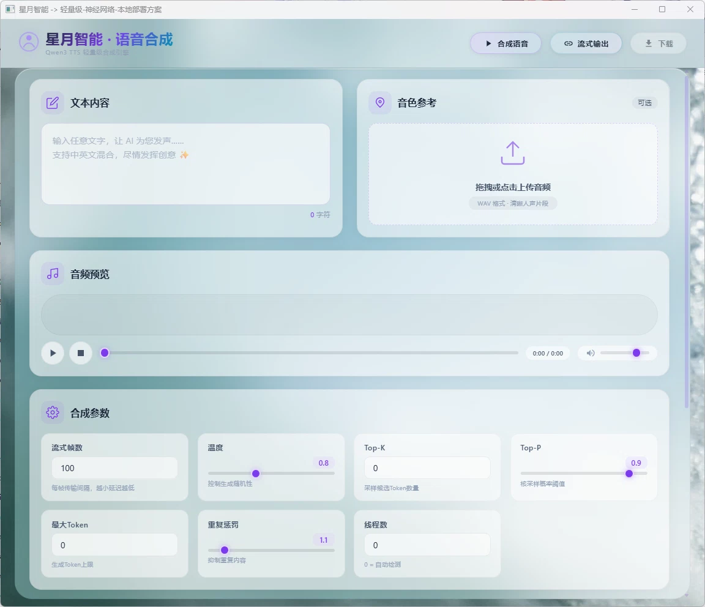
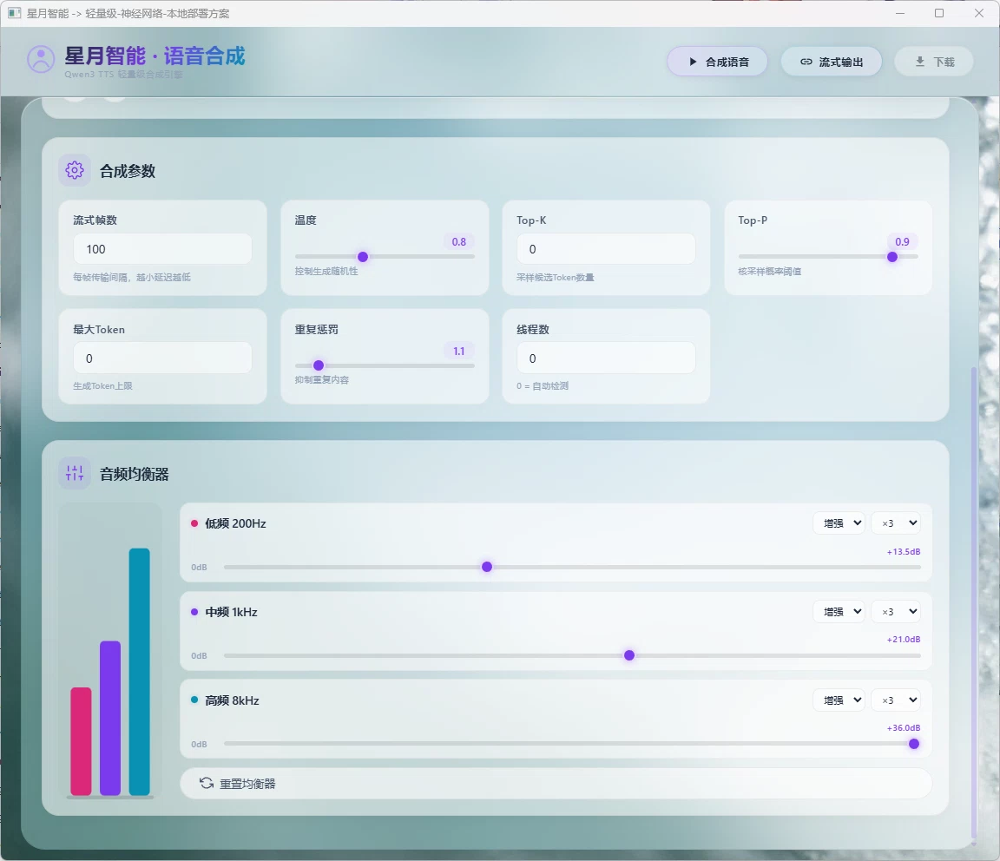

# 独立系统——语音合成（qwen3_tts_lunar）

基于 Qwen3-TTS 模型的本地文本转语音（Text-to-Speech）引擎，采用 C++ GGML 推理后端 + Go HTTP 服务的混合架构。

---

<p style="float: right; margin: 0 0 16px 16px;"></p>

*图：语音合成主界面*

<p style="float: right; margin: 0 0 16px 16px;"></p>

*图：语音合成功能展示*

---

## 目录

- [功能概述](#功能概述)
- [项目结构](#项目结构)
- [核心架构](#核心架构)
- [核心模块说明](#核心模块说明)
- [API 接口定义](#api-接口定义)
- [编译与运行](#编译与运行)
- [使用示例](#使用示例)
- [常见问题](#常见问题)

---

## 功能概述

Qwen3-TTS Lunar 是一个全本地化的语音合成引擎，支持将中文文本转换为自然流畅的语音输出。

| 特性 | 说明 |
|------|------|
| 文本转语音 | 支持中文文本合成，支持流式输出 |
| 音色克隆 | 通过参考音频（reference audio）控制合成音色 |
| GPU 加速 | 通过 CUDA、Vulkan、Metal 等多后端加速推理 |
| 本地运行 | 纯 C++/Go 实现，无需 Python 环境 |
| 嵌入式界面 | Go 内嵌 Web UI，WebView 桌面窗口 |

---

## 项目结构

<div style="font-family: 'Cascadia Code', 'SF Mono', Consolas, monospace; font-size: 0.9em; line-height: 1.6;">
  <ul style="list-style-type: none; padding-left: 0;">
    <li><strong>qwen3_tts_lunar/</strong></li>
    <li style="padding-left: 1.5em;"><code>main.go</code> <span style="color: #6a737d;">— 程序入口</span></li>
    <li style="padding-left: 1.5em;"><code>go.mod</code> <span style="color: #6a737d;">— Go 模块定义</span></li>
    <li style="padding-left: 1.5em;"><code>server.go</code> <span style="color: #6a737d;">— HTTP 服务器</span></li>
    <li style="padding-left: 1.5em;"><code>build.ps1</code> <span style="color: #6a737d;">— Go 编译脚本</span></li>
    <li style="padding-left: 1.5em;"><code>build_cpp.ps1</code> <span style="color: #6a737d;">— C++ 引擎编译脚本</span></li>
    <li style="padding-left: 1.5em;"><code>build_ggml.ps1</code> <span style="color: #6a737d;">— GGML 库编译脚本</span></li>
    <li style="padding-left: 1.5em;"><code>icon.ico</code> <span style="color: #6a737d;">— 应用图标</span></li>
    <li style="padding-left: 1.5em;">
      <strong>module/</strong> <span style="color: #6a737d;">— Go 逻辑层</span>
      <ul style="list-style-type: none; padding-left: 1.5em;">
        <li><code>generate.go</code> <span style="color: #6a737d;">— 语音生成核心逻辑</span></li>
        <li><code>variable.go</code> <span style="color: #6a737d;">— TTS 引擎全局变量</span></li>
        <li><code>stream.go</code> <span style="color: #6a737d;">— 流式音频输出</span></li>
      </ul>
    </li>
    <li style="padding-left: 1.5em;">
      <strong>client/</strong> <span style="color: #6a737d;">— 前端界面</span>
      <ul style="list-style-type: none; padding-left: 1.5em;">
        <li><code>index.html</code> <span style="color: #6a737d;">— 主页面（玻璃拟态风格）</span></li>
        <li><code>app.js</code> <span style="color: #6a737d;">— 前端逻辑</span></li>
        <li><code>style.css</code> <span style="color: #6a737d;">— 样式表</span></li>
        <li><code>picture.webp</code> <span style="color: #6a737d;">— 背景装饰图</span></li>
        <li><code>favicon.ico</code> <span style="color: #6a737d;">— 图标</span></li>
      </ul>
    </li>
    <li style="padding-left: 1.5em;">
      <strong>cpp/</strong> <span style="color: #6a737d;">— C++ 推理引擎</span>
      <ul style="list-style-type: none; padding-left: 1.5em;">
        <li><code>CMakeLists.txt</code> <span style="color: #6a737d;">— CMake 构建配置</span></li>
        <li>
          <strong>ggml/</strong> <span style="color: #6a737d;">— GGML 张量计算库（子模块）</span>
          <ul style="list-style-type: none; padding-left: 1.5em;">
            <li><strong>include/</strong> <span style="color: #6a737d;">— 头文件（ggml.h, gguf.h 等 25+）</span></li>
            <li><strong>src/</strong> <span style="color: #6a737d;">— GGML 核心源码 + 多后端（CUDA/Vulkan/Metal/SYCL 等）</span></li>
            <li><code>CMakeLists.txt</code></li>
          </ul>
        </li>
        <li>
          <strong>src/</strong> <span style="color: #6a737d;">— TTS 引擎源码</span>
          <ul style="list-style-type: none; padding-left: 1.5em;">
            <li><code>qwen3_tts.cpp/h</code> <span style="color: #6a737d;">— TTS 主引擎（模型加载与推理流程）</span></li>
            <li><code>qwen3tts_c_api.cpp/h</code> <span style="color: #6a737d;">— C API 接口（供 Go CGO 调用）</span></li>
            <li><code>qwen3tts.def</code> <span style="color: #6a737d;">— Windows DLL 导出定义</span></li>
            <li><code>tts_transformer.cpp/h</code> <span style="color: #6a737d;">— Transformer 层实现</span></li>
            <li><code>audio_tokenizer_encoder.cpp/h</code> <span style="color: #6a737d;">— 音频编码器</span></li>
            <li><code>audio_tokenizer_decoder.cpp/h</code> <span style="color: #6a737d;">— 音频解码器</span></li>
            <li><code>gguf_loader.cpp/h</code> <span style="color: #6a737d;">— GGUF 模型文件加载器</span></li>
            <li><code>text_tokenizer.cpp/h</code> <span style="color: #6a737d;">— 文本分词器</span></li>
            <li><code>coreml_code_predictor.cpp/h/mm</code> <span style="color: #6a737d;">— Apple CoreML 加速（可选）</span></li>
            <li><code>main.cpp</code> <span style="color: #6a737d;">— 独立可执行文件入口</span></li>
          </ul>
        </li>
      </ul>
    </li>
  </ul>
</div>

---

## 核心架构

### 三层异构架构

```
┌──────────────────────────────────────────────┐
│                Go 服务层                       │
│  main.go → HTTP API → WebSocket 推送          │
│  module/generate.go → CGO 调用 C++ 引擎       │
│  module/stream.go   → 流式音频输出管理         │
└────────────────────┬─────────────────────────┘
                     │ CGO
┌────────────────────▼─────────────────────────┐
│              C++ 推理引擎（DLL）               │
│  qwen3tts_c_api.cpp  →  C API 接口层          │
│  qwen3_tts.cpp       →  模型加载 + 推理流程    │
│  tts_transformer.cpp  →  Transformer 神经网络  │
│  audio_tokenizer_*.cpp → 音频编解码器          │
│  gguf_loader.cpp      →  GGUF 模型加载         │
│  text_tokenizer.cpp   →  文本→Token 转换       │
└────────────────────┬─────────────────────────┘
                     │
┌────────────────────▼─────────────────────────┐
│              GGML 张量计算库                   │
│  底层张量运算 + 多 GPU 后端加速                 │
│  CUDA · Vulkan · Metal · SYCL · OpenCL · BLAS │
└──────────────────────────────────────────────┘
```

### 引擎推理流程

```
文本输入
    │
    ▼
text_tokenizer → Token IDs
    │
    ▼
tts_transformer.forward()
    ├── Token Embedding → Transformer Encoder
    ├── Cross-Attention with Audio Encoder
    └── Output: Audio Latent Tokens
    │
    ▼
audio_tokenizer_decoder → 音频波形 (PCM float32[])
    │
    ▼
WAV 封装 → .wav 文件/流
```

---

## 核心模块说明

### Go 层 (module/)

| 文件 | 关键函数 | 说明 |
|------|---------|------|
| [variable.go](module/variable.go) | `InitTTSEngine()` | 初始化 TTS 引擎（加载模型 + 参考音频） |
| [generate.go](module/generate.go) | `GenerateSpeech()` | CGO 调用 C++ 引擎生成音频 |
| [stream.go](module/stream.go) | `StreamAudio()` | 流式音频输出管理 |

### C++ 层 (cpp/src/)

| 文件 | 说明 |
|------|------|
| `qwen3_tts.cpp/h` | 主引擎：模型加载、推理流程编排、音频后处理 |
| `qwen3tts_c_api.cpp/h` | C API 接口层，提供 `qwen3tts_init()`、`qwen3tts_generate()` 等导出函数 |
| `tts_transformer.cpp/h` | Transformer 模型实现（Self-Attention、Cross-Attention、FFN） |
| `audio_tokenizer_encoder.cpp/h` | 音频编码器：参考音频 → 音频特征 |
| `audio_tokenizer_decoder.cpp/h` | 音频解码器：Latent Tokens → PCM 波形 |
| `gguf_loader.cpp/h` | GGUF 格式模型文件加载与权重映射 |
| `text_tokenizer.cpp/h` | GPT-2 BPE 文本分词器 |

### GGML 后端支持

GGML 库通过条件编译支持多种 GPU 加速后端：

| 后端 | 标志 | 适用平台 |
|------|------|---------|
| CUDA | `GGML_USE_CUDA` | NVIDIA GPU |
| Vulkan | `GGML_USE_VULKAN` | 跨平台 GPU |
| Metal | `GGML_USE_METAL` | Apple Silicon |
| SYCL | `GGML_USE_SYCL` | Intel GPU |
| OpenCL | `GGML_USE_OPENCL` | 通用 GPU |
| BLAS | `GGML_USE_BLAS` | CPU 加速 |
| RPC | `GGML_USE_RPC` | 远程推理 |

---

## API 接口定义

### HTTP 端点

| 方法 | 路径 | 说明 |
|------|------|------|
| POST | `/tts/generate` | 文本转语音生成 |
| GET | `/tts/stream` | 流式音频输出（SSE） |
| GET | `/health` | 健康检查 |

### 语音生成请求

```json
// POST /tts/generate
{
  "text": "你好，我是月华，很高兴认识你！",
  "voice": "default",
  "speed": 1.0,
  "format": "wav"
}
```

### 语音生成响应

```json
{
  "success": true,
  "audio": "base64_encoded_wav_data...",
  "duration_ms": 3250,
  "format": "wav",
  "sample_rate": 24000
}
```

---

## 编译与运行

### 编译步骤

```powershell
cd d:\Lunar_Astral_Agents\subsystem\qwen3_tts_lunar
.\build.ps1
```

`build.ps1` 是**一站式构建入口**，自动按顺序完成三个阶段：

| 阶段 | 内容 | 内部脚本 |
|------|------|---------|
| Stage 1 | 编译 GGML 张量计算库 | `build_ggml.ps1` |
| Stage 2 | 编译 Qwen3-TTS C++ 推理引擎 | `build_cpp.ps1` |
| Stage 3 | 编译 Go 服务层 | `go build` |

> `build_ggml.ps1` 和 `build_cpp.ps1` 是内部实现细节，由 `build.ps1` 自动调用，无需手动执行。

可选参数：

```powershell
.\build.ps1 -SkipGGML        # 跳过 GGML 编译（已编译过时使用）
.\build.ps1 -SkipCPP         # 跳过 C++ 编译
.\build.ps1 -SkipGo          # 跳过 Go 编译
.\build.ps1 -Clean           # 清理后重新编译
.\build.ps1 -BuildType Debug # Debug 模式编译
```

编译产物：`d:\Lunar_Astral_Agents\Qwen3_TTS_Lunar.exe`

### 运行要求

1. 确保模型文件（GGUF 格式）放置在 `{LocalDir}/models/` 目录
2. 确保参考音频文件存在（默认 `{LocalDir}/audios/lunar-template.wav`）

### 运行

```powershell
.\Qwen3_TTS_Lunar.exe
```

程序自动打开 WebView 窗口，提供可视化文本输入与语音播放界面。

---

## 使用示例

### Go 代码集成

```go
package main

import "qwen3_tts_lunar/module"

func main() {
    // 初始化 TTS 引擎
    modelDir := "./models"
    refAudio := "./audios/reference.wav"
    module.InitTTSEngine(modelDir, refAudio)

    // 生成语音
    audioBytes, err := module.GenerateSpeech("你好世界！", "default", 1.0)
    if err != nil {
        panic(err)
    }

    // 保存到文件
    os.WriteFile("output.wav", audioBytes, 0644)
}
```

### HTTP API 调用

```bash
# 文本转语音
curl -X POST http://localhost:PORT/tts/generate \
  -H "Content-Type: application/json" \
  -d '{"text": "你好，很高兴认识你！", "voice": "default"}'

# 流式生成
curl http://localhost:PORT/tts/stream \
  -H "Content-Type: application/json" \
  -d '{"text": "这是一段较长的文本，将以流式方式输出音频段。"}'
```

---

## 常见问题

### Q: 模型文件在哪里下载？

Qwen3-TTS 的 GGUF 格式模型可从 Hugging Face 或 ModelScope 获取。将下载的 `.gguf` 文件放入 `{LocalDir}/models/` 目录即可。

### Q: 如何获得更好的音色克隆效果？

使用高质量的参考音频（建议 16kHz 或 24kHz，单声道，PCM WAV 格式），时长建议 5-15 秒，内容涵盖丰富的语音特征。

### Q: CUDA 加速如何启用？

在编译 GGML 时启用 CUDA 支持，确保系统已安装 CUDA Toolkit 12.x 或 13.x。编译完成后引擎会自动检测并使用 GPU。

### Q: 生成速度慢怎么办？

1. 启用 GPU 加速（CUDA/Vulkan）
2. 减少生成长度或使用流式输出降低初始延迟
3. 使用量化模型（Q4_K_M 等）减少推理计算量

---

## 相关文档

- [项目主文档](../../README.md) —— 环境要求与编译流程
- [配置管理子系统](../config/README.md) —— 模型路径配置
- [星图·月华](../../lunar_astral/README.md) —— TTS 引擎的集成使用方
- [语音识别独立系统](../qwen_asr_lunar/README.md) —— ASR 语音转文本引擎