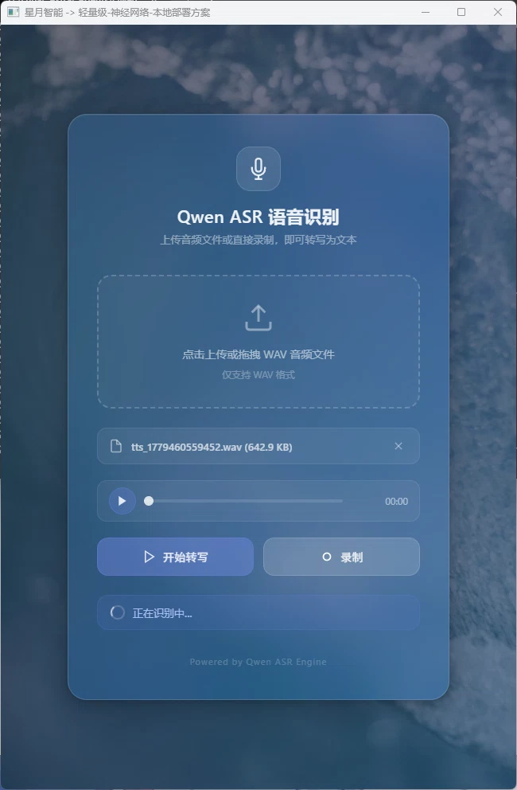
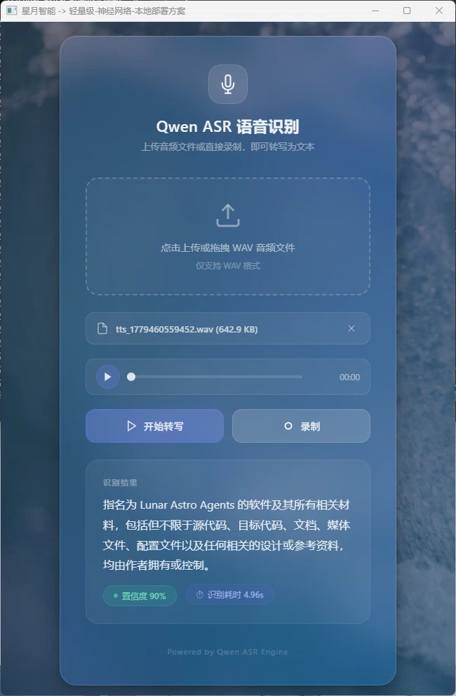

# 独立系统——语音识别（qwen_asr）

基于 Qwen3-ASR 模型的本地语音识别（Automatic Speech Recognition）引擎，采用纯 C 语言推理引擎 + Go HTTP 服务的混合架构，支持 0.6B 和 1.7B 两种模型规模。

---

<p style="float: right; margin: 0 0 16px 16px;"></p>

*图：语音识别主界面*

<p style="float: right; margin: 0 0 16px 16px;"></p>

*图：语音识别结果展示*

---

## 目录

- [功能概述](#功能概述)
- [项目结构](#项目结构)
- [核心架构](#核心架构)
- [核心模块说明](#核心模块说明)
- [API 接口定义](#api-接口定义)
- [编译与运行](#编译与运行)
- [使用示例](#使用示例)
- [常见问题](#常见问题)

---

## 功能概述

Qwen ASR Lunar 是一个全本地化的语音识别引擎，支持多语言音频转录。

| 特性 | 说明 |
|------|------|
| 离线识别 | 纯本地运行，无需网络连接 |
| 多语言支持 | 支持中/英/粤/日/韩/法/德/西/俄等 30 种语言 |
| 双模型 | 自动检测 0.6B 或 1.7B 模型规模 |
| 高精度 BF16 | BF16 权重零拷贝推理，保持模型精度 |
| SIMD 加速 | AVX2/AVX-512/NEON 编译时自动选择 |
| 实时录音 | 浏览器端 MediaRecorder API 录音 |
| 音频格式自适应 | 非 WAV 格式自动通过 FFmpeg 转换 |

---

## 项目结构

<div style="font-family: 'Cascadia Code', 'SF Mono', Consolas, monospace; font-size: 0.9em; line-height: 1.6;">
  <ul style="list-style-type: none; padding-left: 0;">
    <li><strong>qwen_asr/</strong></li>
    <li style="padding-left: 1.5em;"><code>main.go</code> <span style="color: #6a737d;">— 程序入口（HTTP + WebView）</span></li>
    <li style="padding-left: 1.5em;"><code>go.mod</code> <span style="color: #6a737d;">— Go 模块定义</span></li>
    <li style="padding-left: 1.5em;"><code>asr.go</code> <span style="color: #6a737d;">— Go↔C 桥接层（CGO 绑定）</span></li>
    <li style="padding-left: 1.5em;"><code>handler.go</code> <span style="color: #6a737d;">— HTTP 请求处理 + 音频格式转换</span></li>
    <li style="padding-left: 1.5em;"><code>build.ps1</code> <span style="color: #6a737d;">— 编译脚本</span></li>
    <li style="padding-left: 1.5em;"><code>icon.ico</code> <span style="color: #6a737d;">— 应用图标</span></li>
    <li style="padding-left: 1.5em;">
      <strong>static/</strong> <span style="color: #6a737d;">— 前端界面（Go embed 嵌入）</span>
      <ul style="list-style-type: none; padding-left: 1.5em;">
        <li><code>index.html</code> <span style="color: #6a737d;">— 主页面（毛玻璃风格）</span></li>
        <li><code>app.js</code> <span style="color: #6a737d;">— 前端逻辑（文件上传/录音/API调用）</span></li>
        <li><code>style.css</code> <span style="color: #6a737d;">— 样式表（深色主题）</span></li>
        <li><code>picture.webp</code> <span style="color: #6a737d;">— 背景装饰图</span></li>
        <li><code>favicon.ico</code> <span style="color: #6a737d;">— 图标</span></li>
      </ul>
    </li>
    <li style="padding-left: 1.5em;">
      <strong>openblas/</strong> <span style="color: #6a737d;">— OpenBLAS 线性代数库</span>
      <ul style="list-style-type: none; padding-left: 1.5em;">
        <li>
          <strong>include/</strong> <span style="color: #6a737d;">— C 头文件</span>
          <ul style="list-style-type: none; padding-left: 1.5em;">
            <li><code>cblas.h</code> <span style="color: #6a737d;">— C BLAS 接口</span></li>
            <li><code>f77blas.h</code> <span style="color: #6a737d;">— Fortran BLAS 接口</span></li>
            <li><code>lapack.h/lapacke.h</code> <span style="color: #6a737d;">— LAPACK 接口</span></li>
            <li><code>openblas_config.h</code> <span style="color: #6a737d;">— 编译配置</span></li>
          </ul>
        </li>
      </ul>
    </li>
    <li style="padding-left: 1.5em;">
      <strong>C 推理引擎源码</strong> <span style="color: #6a737d;">— 纯 C 实现，零 Python 依赖</span>
      <ul style="list-style-type: none; padding-left: 1.5em;">
        <li><code>qwen_asr.h/c</code> <span style="color: #6a737d;">— 主入口：模型加载/释放、推理管线编排</span></li>
        <li><code>qwen_asr_audio.h/c</code> <span style="color: #6a737d;">— 音频预处理：WAV 加载、Mel spectrogram 计算</span></li>
        <li><code>qwen_asr_encoder.c</code> <span style="color: #6a737d;">— 编码器：Conv2D Stem + Transformer Encoder</span></li>
        <li><code>qwen_asr_decoder.c</code> <span style="color: #6a737d;">— 解码器：Qwen3 LLM 自回归解码</span></li>
        <li><code>qwen_asr_tokenizer.h/c</code> <span style="color: #6a737d;">— GPT-2 BPE 分词器</span></li>
        <li><code>qwen_asr_safetensors.h/c</code> <span style="color: #6a737d;">— SafeTensors 模型加载器（多分片 + mmap）</span></li>
        <li><code>qwen_asr_kernels.h/c</code> <span style="color: #6a737d;">— 数学核心：矩阵运算、注意力、归一化</span></li>
        <li><code>qwen_asr_kernels_impl.h</code> <span style="color: #6a737d;">— 架构调度：编译时选择 SIMD 路径</span></li>
        <li><code>qwen_asr_kernels_avx.c</code> <span style="color: #6a737d;">— x86 SIMD 优化（AVX2+FMA / AVX-512F+BW）</span></li>
        <li><code>qwen_asr_kernels_neon.c</code> <span style="color: #6a737d;">— ARM NEON 优化</span></li>
        <li><code>qwen_asr_kernels_generic.c</code> <span style="color: #6a737d;">— 通用纯 C 实现（无 SIMD 回退）</span></li>
      </ul>
    </li>
  </ul>
</div>

---

## 核心架构

### 完整推理管线

```
WAV 文件（16kHz, 16-bit, mono, PCM）
    │
    ▼
① qwen_load_wav()
   解析 RIFF/WAVE 头，提取 PCM → float32[-1,1]
    │
    ▼
② qwen_mel_spectrogram()
   STFT → |FFT|² → Mel filterbank (128 bins) → log10 → clamp
   输出: [128 mel_bins, T_frames]
    │
    ▼
③ qwen_encoder_forward()           [qwen_asr_encoder.c]
   Conv2D Stem (3层, 3×3, stride=2) → 降采样频率轴
   Transformer Encoder × 24/18 层:
     · 双向窗口注意力（windowed attention）
     · GELU FFN（带 bias）
     · LayerNorm（带 bias）
   正弦位置编码
   投影层: proj1(GELU) → proj2
   输出: audio embeddings [T_enc, enc_output_dim]
    │
    ▼
④ 构建 ChatML Prompt
   <|im_start|> system \n [可选提示] <|im_end|>
   \n <|im_start|> user \n <|audio_start|>
   151676 × N_audio         ← audio embeddings 在此插入
   <|audio_end|> <|im_end|> \n <|im_start|> assistant \n
   [可选: "language X" + <|asr_text|>]
    │
    ▼
⑤ Decoder Prefill + Autoregressive Decode   [qwen_asr_decoder.c]
   Prefill: 将所有 prompt (文本+音频 tokens) 一次性前向传播填充 KV Cache
   Decode: 逐 token 自回归生成:
     RMSNorm → QKV 投影 (bf16, 无 bias)
     → Per-head Q/K RMSNorm → NeoX RoPE
     → 因果 GQA 注意力 → Output 投影
     → RMSNorm → SwiGLU MLP (gate/up/down)
     → 最后一层 hidden state → argmax 选最可能 token
   直到遇到 <|im_end|> 或达到最大长度
    │
    ▼
⑥ Tokenizer Decode → UTF-8 文本
   GPT-2 byte-level BPE tokenizer
   返回 C 字符串
```

### 编译时 SIMD 架构选择

```c
// kernels_impl.h
#ifdef __ARM_NEON        → qwen_*_neon  (ARM SIMD)
#elif __AVX2__ && __FMA__ → qwen_*_avx   (x86 AVX2/AVX-512)
#else                     → qwen_*_generic (纯 C)
```

### 数学核心（Kernels）

| Kernel | 用途 | 优化级别 |
|--------|------|---------|
| `qwen_bf16_matvec_fused` | **最热路径**：每 token 生成时的 bf16 矩阵-向量乘 | AVX-512/AVX2/NEON |
| `qwen_argmax_bf16_range` | 流式 argmax：不物化全部 logits，直接找最大值 | AVX-512/AVX2/NEON |
| `qwen_linear` / `_bf16` / `_nobias` | 通用全连接层 | AVX-512/AVX2/NEON |
| `qwen_conv2d` | 编码器 Conv2D Stem | 多线程并行 |
| `qwen_bidirectional_attention` | 编码器窗口注意力 | 多线程并行 |
| `qwen_causal_attention` | 解码器因果 GQA 注意力 | 多线程 KV Cache |
| `qwen_rms_norm` / `qwen_layer_norm` | 归一化层 | SIMD |
| `qwen_silu` / `qwen_gelu` / `qwen_softmax` | 激活函数 | SIMD |
| `qwen_swiglu_multiply` | SwiGLU 融合乘法 | SIMD |
| `qwen_compute_rope_neox` / `apply` | NeoX RoPE 位置编码 | SIMD |

### 性能关键优化

- **全 BF16 权重存储**：151936 × 2048 词表嵌入 + 28 层变换器用 BF16 mmap，内存减半
- **流式 argmax**：不预生成 151936 维 logits，直接分行比较找最大，大幅减少内存带宽
- **零拷贝权重**：`safetensors_get_bf16_direct()` 从 mmap 区域直接读取
- **静音压缩**：`compact_silence()` 自适应 RMS 阈值去除长静音
- **线程池**：最多 16 线程并行化 encoder chunk 和注意力

---

## API 接口定义

### HTTP 端点

| 方法 | 路径 | 说明 |
|------|------|------|
| POST | `/asr` | 音频转写（multipart/form-data, `audio` 字段） |
| GET | `/health` | 健康检查 |

### 转写请求

```bash
POST /asr
Content-Type: multipart/form-data

# 表单字段：audio = <音频文件>
```

约束：
- 最大文件大小：32MB
- 支持格式：WAV（推荐）或任意 FFmpeg 可转码格式
- 非 WAV 格式自动通过 FFmpeg 转换为 16kHz/16-bit/mono/PCM WAV

### 转写响应

```json
{
  "status": "success",
  "text": "你好，我是月华，很高兴认识你",
  "confidence": 0.95,
  "audio_format": "wav"
}
```

| 字段 | 类型 | 说明 |
|------|------|------|
| `status` | `string` | `"success"` 或 `"error"` |
| `text` | `string` | 转写文本 |
| `confidence` | `float` | 置信度估计（0.0-1.0） |
| `audio_format` | `string` | 实际处理的音频格式 |

---

## 编译与运行

### 编译

```powershell
cd d:\Lunar_Astral_Agents\subsystem\qwen_asr

# 编译（可选 OpenBLAS 加速）
.\build.ps1
```

编译参数：

| 参数 | 说明 |
|------|------|
| `CGO_ENABLED=1` | 启用 CGO 调用 C 推理引擎 |
| `GOARCH=amd64` | 目标架构为 64 位 |
| `-O3 -march=native` | GCC 最高优化级别 |
| `-ffast-math` | 快速数学模式 |
| `-funroll-loops` | 循环展开优化 |
| `-DUSE_BLAS`（可选） | 启用 OpenBLAS 加速 |

编译产物：`d:\Lunar_Astral_Agents\Qwen_ASR_Lunar.exe`

### 运行

```powershell
.\Qwen_ASR_Lunar.exe
```

程序自动打开 WebView 窗口（648×960），提供文件上传、浏览器录音与转写结果展示。

---

## 使用示例

### HTTP API 调用

```bash
# 使用 curl 转写 WAV 文件
curl -X POST http://localhost:PORT/asr \
  -F "audio=@audio.wav"

# 返回值
# {"status":"success","text":"你好世界","confidence":0.93,"audio_format":"wav"}

# 使用录音（WebM 格式，自动转码）
curl -X POST http://localhost:PORT/asr \
  -F "audio=@recording.webm"
```

### Go 代码集成

> qwen_asr 是独立可执行程序（`package main`），以下调用方式即 `main.go` 内部的实际用法，供集成方参考。

```go
// 初始化 ASR 引擎
asr, err := New("path/to/model/dir")
if err != nil {
    panic(err)
}
defer asr.Close()

// 文件转写
text, err := asr.TranscribeWavFile("audio.wav")
fmt.Println(text)

// 设置语言提示（可选）
asr.SetLanguage("zh")
asr.SetPrompt("以下是中文普通话的转写结果。")
```

---

## 常见问题

### Q: 支持哪些音频格式？

推荐使用 **16kHz, 16-bit, mono, PCM WAV** 格式以获得最佳效果。其他格式（MP3、WebM、OGG、FLAC 等）会自动通过 FFmpeg 转换为标准格式。

### Q: 如何启用 OpenBLAS 加速？

编译时添加 `USE_BLAS` 标志：

```powershell
$env:CGO_CFLAGS = "-O3 -march=native -DUSE_BLAS -fopenmp"
$env:CGO_LDFLAGS = "-L./openblas/lib -lopenblas -fopenmp"
.\build.ps1
```

确保 OpenBLAS 库文件（.dll/.lib）在链接路径中。

### Q: 0.6B 和 1.7B 模型如何选择？

引擎会自动检测模型目录中的 SafeTensors 文件，根据 `encoder.layers` 的数量判断模型规模（24 层 = 0.6B，18 层 = 1.7B）。0.6B 速度更快，1.7B 精度更高。

### Q: 为什么转写速度慢？

1. 启用 OpenBLAS 加速（编译时 `-DUSE_BLAS`）
2. 使用 0.6B 模型替代 1.7B
3. 检查 CPU 是否有 AVX2 指令集支持
4. 长音频使用分段模式（`segment_sec` 参数）

---

## 相关文档

- [项目主文档](../../README.md) —— 环境要求与编译流程
- [配置管理子系统](../general_config/README.md) —— 模型路径配置
- [语音合成独立系统](../qwen3_tts/README.md) —— TTS 文本转语音引擎
- [星图·月华](../../lunar_astral/README.md) —— ASR 引擎可集成使用方